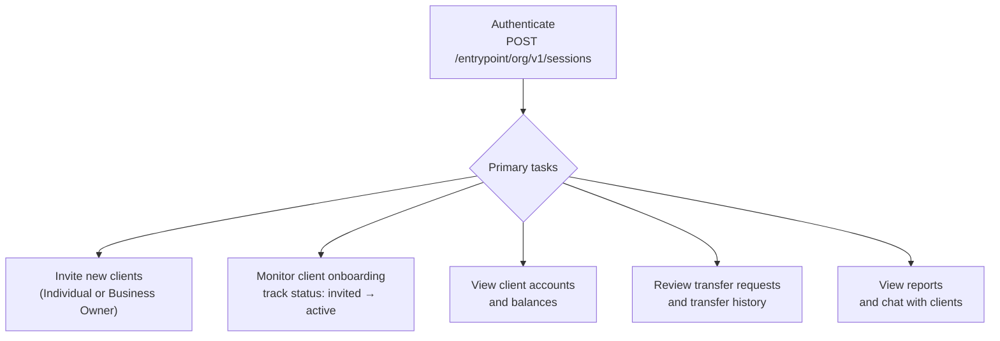

The Advisor is the front-line admin role your integration will use most frequently — inviting Individual and Business Owner clients, tracking onboarding progress, and monitoring accounts, transfers, reports, and the chat module.

---

## Capabilities

- Invite **Individual** clients — triggers an invitation email and starts the KYC onboarding flow
- Invite **Business Owner** clients — triggers an invitation email and starts the KYB onboarding flow
- View and manage their own portfolio of **Individual and Business Owner clients**
- View client **accounts and balances**
- View **transfer requests, transfers, and auto-payments** for all clients in their portfolio
- View **client and system reports**
- Access the **chat module**

---

## Daily Workflow



---

## Authentication

Use your organization's `clientId` and `clientSecret` to create a session. See [Authentication](/docs/authentication) for the full flow. Include `X-Session-Id` and `X-Client-Id` on every request.

---

## Step 1 — Invite an Individual Client

`POST /branches/private/v1/individual`

- **Auth**: Advisor access token

```json
{
  "firstName": "Jane",
  "lastName": "Doe",
  "email": "jane.doe@example.com",
  "phoneNumber": "+12025550191"
}
```

On success, an invitation email is sent and the client record is created with `status: "invited"`. The client then follows the [Individual Account](../individual-user) onboarding steps.

---

## Step 3 — Invite a Business Owner Client

`POST /branches/private/v1/business-owner`

- **Auth**: Advisor access token

```json
{
  "firstName": "Alex",
  "lastName": "Rivera",
  "email": "alex.rivera@acmecorp.com",
  "phoneNumber": "+13105550177"
}
```

On success, an invitation email is sent and the Business Owner record is created with `status: "invited"`. The client then follows the [Business Owner](../business-owner) KYB onboarding steps.

---

## Step 4 — Monitor Your Client Portfolio

**List Individual clients:**

`GET /branches/private/v1/individual`

- **Auth**: Advisor access token
- Returns all Individual clients in this Advisor's branch, paginated.

```
GET /branches/private/v1/individual?page[number]=1&page[size]=20
X-Session-Id: <sessionId>
X-Client-Id:  <clientId>
```

Filter by onboarding status to track who still needs to complete their registration:

```
GET /branches/private/v1/individual?filter[status]=eq:invited&page[number]=1&page[size]=20
```

**Get a single client's full profile:**

`GET /branches/private/v1/individual/{id}`

- **Auth**: Advisor access token

---

## Client Status Reference

| Status       | Meaning                                                      | Action                                         |
|--------------|--------------------------------------------------------------|------------------------------------------------|
| `invited`    | Invitation sent; client has not yet accepted                 | No action needed — wait for client to accept  |
| `onboarding` | Client is completing registration steps                      | Monitor progress                               |
| `pending`    | KYC or KYB submitted; awaiting review                        | No action needed — review is automated        |
| `active`     | Verified; accounts are live and fully operational            | Client ready for all banking features          |
| `dormant`    | Account inactive for an extended period                      | Contact client or support                      |
| `rejected`   | KYC or KYB failed                                            | Client must re-apply or contact support        |

---

## Access Summary

| Resource                  | Advisor access     |
|---------------------------|--------------------|
| Branches                  | Read               |
| Head Branch Managers      | —                  |
| Branch Managers           | —                  |
| Advisors                  | —                  |
| Individual clients        | Read / Write       |
| Business Owner clients    | Read / Write       |
| Transfer requests         | Read               |
| Transfers                 | Read               |
| Auto-payments             | Read               |
| Reports                   | Read               |
| Approval settings         | —                  |
| Chats                     | Read / Write       |
