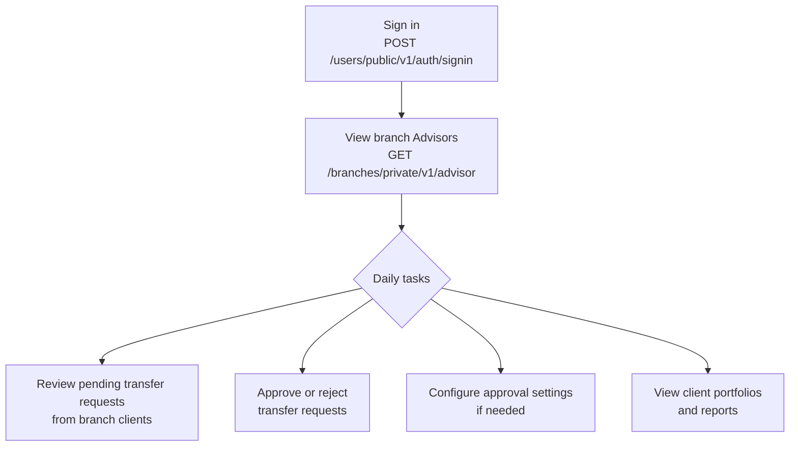
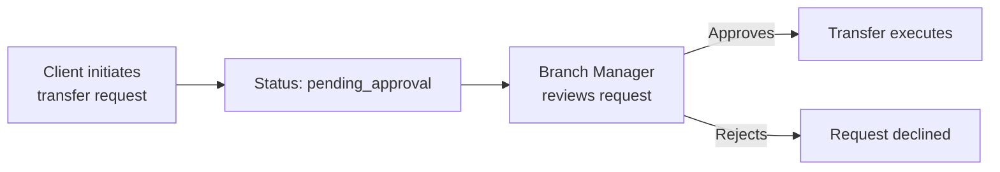

Branch Managers manage Advisors within their branch and control the transfer approval workflow — they can require client transfer requests to pass through their sign-off before executing, a key compliance and oversight control.

---

## Capabilities

- Create and manage **Advisor** accounts within the branch
- View **Individual and Business Owner client portfolios** within the branch
- View client **accounts and balances**
- View **client transfer requests** (but not completed transfers or auto-payments)
- Configure **approval settings** — require Branch Manager sign-off on transfer requests before they execute
- View **client and system reports**

> Branch Managers do not see completed transfers or auto-payments in their view — only pending transfer requests. Transfers and auto-payments are visible to Head Branch Managers and Advisors.

---

## Daily Workflow



---

## Sign In

`POST /users/public/v1/auth/signin`

```json
{
  "login": "branchmanager@yourorg.com",
  "password": "Password123!"
}
```

The `accessToken` expires after **30 minutes**. Refresh it with `POST /users/public/v1/auth/refresh`.

---

## Managing Advisors

Branch Managers can create and manage Advisor accounts within their branch.

**List Advisors in branch:**

`GET /branches/private/v1/advisor`

- **Auth**: Branch Manager access token

```
GET /branches/private/v1/advisor?filter[branchID]=eq:<branch-uuid>&page[number]=1&page[size]=20
Authorization: Bearer <branch_manager_token>
```

---

## Approval Settings

The most distinctive capability of the Branch Manager role. Approval settings control whether client transfer requests require Branch Manager sign-off before funds move.

**Get current approval settings:**

`GET /branches/private/v1/approval-settings`

- **Auth**: Branch Manager access token

**Response:**

```json
{
  "data": {
    "branchId": "b7f2c890-...",
    "isBmApprovalRequired": false
  }
}
```

**Enable or disable approval requirement:**

`PUT /branches/private/v1/approval-settings`

- **Auth**: Branch Manager access token

```json
{
  "is_bm_approval_required": true
}
```

**When `is_bm_approval_required` is `true`:**



**When `is_bm_approval_required` is `false`:**

Client transfer requests execute immediately without Branch Manager review.

---

## Access Summary

| Resource                  | Branch Manager access |
|---------------------------|----------------------|
| Branches                  | Read                 |
| Head Branch Managers      | —                    |
| Branch Managers           | —                    |
| Advisors                  | Read / Write         |
| Individual clients        | Read / Write         |
| Business Owner clients    | Read / Write         |
| Transfer requests         | Read                 |
| Transfers                 | —                    |
| Auto-payments             | —                    |
| Reports                   | Read                 |
| Approval settings         | Read / Write         |
| Chats                     | —                    |
