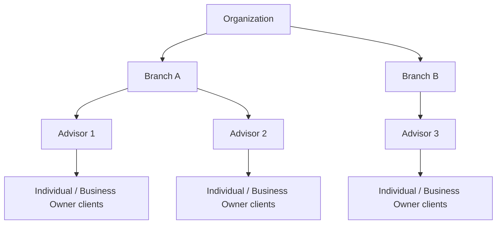

Branches group Advisors and their client portfolios together — every Advisor and client belongs to a branch, managed at the top level by the Root Advisor and operated within by Head Branch Managers and Branch Managers.

---

## Branch Structure



---

## What branches control

- **Advisor assignment** — each Advisor is assigned to exactly one branch
- **Client portfolio grouping** — all clients invited by an Advisor belong to that Advisor's branch
- **Approval settings** — Branch Managers configure whether transfer requests require their approval before executing
- **Reporting scope** — reports and statistics can be filtered to a specific branch

---

## Create a Branch

`POST /branches/private/v1/branch`

- **Auth**: Root Advisor access token

```json
{
  "branchName": "Downtown Branch",
  "description": "Serves the downtown metro area",
  "address": {
    "address": "123 Main St",
    "city": "Austin",
    "state": "TX",
    "zipCode": "78701",
    "country": "US"
  }
}
```

| Field | Type | Required | Notes |
|-------|------|:--------:|-------|
| `branchName` | string | ✓ | 2–50 characters |
| `description` | string | | Up to 255 characters |
| `address.address` | string | ✓ | Street address, 2–50 chars |
| `address.city` | string | ✓ | |
| `address.state` | string | ✓ | 2-letter US state code |
| `address.zipCode` | string | ✓ | US ZIP code |
| `address.country` | string | ✓ | `"US"` |

> After creating a branch, assign a Head Branch Manager and Branch Manager to it — see [Root Advisor](/docs/root-advisor) for those flows.

---

## List Branches

`GET /branches/private/v1/branch`

- **Auth**: Root Advisor access token

```
GET /branches/private/v1/branch?page[number]=1&page[size]=20
Authorization: Bearer <root_advisor_token>
```

Returns a paginated list of branches with their active Head Branch Manager's contact info.

**Response fields per branch:**

| Field | Description |
|-------|-------------|
| `id` | Branch identifier |
| `branchName` | Branch display name |
| `address` | Branch address |
| `description` | Branch description |
| `activeSuperAdvisor` | The active Head Branch Manager assigned to this branch |
| `activeBranchManager` | The active Branch Manager assigned to this branch |

**Import branches in bulk:**

`POST /branches/private/v1/branch/import`

Upload a CSV file as `multipart/form-data`. Contact `support@tappcash.com` for the CSV template.

---

## Get a Branch

`GET /branches/private/v1/branch/:id`

- **Auth**: Root Advisor access token

Returns full branch details including assigned Head Branch Manager and Branch Manager.

**Get your own branch (Head Branch Manager / Branch Manager / Advisor):**

`GET /branches/private/v1/branch/my`

- **Auth**: Head Branch Manager, Branch Manager, or Advisor access token

Returns the branch the calling user is assigned to.

> **Root Advisor cannot use this endpoint.** The Root Advisor manages all branches and is not assigned to any specific one. Calling this endpoint as Root Advisor returns `RELATION_NOT_FOUND`. Use `GET /branches/private/v1/branch` to list all branches, or `GET /branches/private/v1/branch/:id` to get a specific branch by ID.

---

## Update a Branch

`PUT /branches/private/v1/branch/:id`

- **Auth**: Root Advisor access token

Both `description` and `address` are required:

```json
{
  "description": "Updated description",
  "address": {
    "address": "456 Oak Ave",
    "city": "Austin",
    "state": "TX",
    "zipCode": "78702",
    "country": "US"
  }
}
```

> `branchName` cannot be changed after creation.

---

## Assign Admin Roles to a Branch

After creating a branch, assign Head Branch Managers, Branch Managers, and Advisors to it. These calls are made by the Root Advisor.

**Create Head Branch Manager:**

`POST /branches/private/v1/branch/:id/superadvisor`

**Create Branch Manager:**

`POST /branches/private/v1/branch/:id/branchmanager`

**Create Advisor:**

`POST /branches/private/v1/branch/:id/advisor`

See the [Root Advisor](/docs/root-advisor) and [Advisor](/docs/advisor) pages for full request body schemas.

---

## Approval Settings

Branch Managers can require their sign-off on transfer requests within their branch. When enabled, any client transfer request moves to a pending-approval state before executing.

**Get approval settings:**

`GET /branches/private/v1/approval-settings`

- **Auth**: Branch Manager (or higher) access token

**Update approval settings:**

`PUT /branches/private/v1/approval-settings`

- **Auth**: Branch Manager access token

```json
{
  "is_bm_approval_required": true
}
```

| Field | Type | Description |
|-------|------|-------------|
| `is_bm_approval_required` | boolean | `true` = transfer requests require Branch Manager approval before executing |

> Only Branch Managers can update this setting. Root Advisors and Head Branch Managers have read-only access.

---

## Access by Role

| Operation | Root Advisor | Head Branch Manager | Branch Manager | Advisor |
|-----------|:---:|:---:|:---:|:---:|
| Create branch | ✓ | | | |
| List all branches | ✓ | | | |
| Get branch by ID | ✓ | | | |
| Get my branch | | ✓ | ✓ | ✓ |
| Update branch | ✓ | | | |
| Assign Head Branch Manager | ✓ | | | |
| Assign Branch Manager | ✓ | | | |
| Assign Advisor | ✓ | | | |
| View approval settings | ✓ | ✓ | ✓ | |
| Update approval settings | | | ✓ | |
