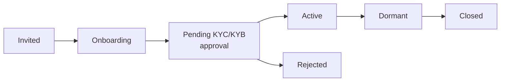

Advisors and higher admin roles manage portfolios of Individual and Business Owner clients — both types support full listing, filtering, detail view, account inspection, and balance export.

---

## Client Types

<Cards>
  <Card title="Individual Clients" href="/docs/individual-user" icon="fa-duotone fa-user">Personal account holders who complete KYC verification. Manage their profiles, view accounts, transactions, transfers, and export balances.</Card>
  <Card title="Business Owner Clients" href="/docs/business-owner" icon="fa-duotone fa-building">Business account holders who complete KYB verification. Manage their business profiles, view business accounts, and oversee Operator access.</Card>
</Cards>

---

## Individual Client Management

### List Individual Clients

`GET /branches/private/v1/individual`

- **Auth**: Advisor (or higher) access token

```
GET /branches/private/v1/individual?page[number]=1&page[size]=20&filter[status]=active
Authorization: Bearer <advisor_token>
```

**Query parameters:**

| Parameter | Description |
|-----------|-------------|
| `page[number]` | Page number (default: 1) |
| `page[size]` | Results per page (default: 20) |
| `filter[status]` | `active`, `pending`, `invited`, `rejected`, `dormant`, `closed` |
| `sort` | Field to sort by, prefix `-` for descending (e.g. `-createdAt`) |

**Response fields per client:**

| Field | Description |
|-------|-------------|
| `id` | Client identifier |
| `firstName` / `lastName` | Client name |
| `email` | Contact email |
| `phoneNumber` | Contact phone |
| `status` | Current lifecycle status |
| `advisor` | Assigned Advisor |
| `branch` | Assigned branch (visible to Root Advisor and higher) |
| `currentTier` | KYC tier level |
| `kycErrors` | Any KYC rejection reasons |

### Invite an Individual Client

`POST /branches/private/v1/individual`

- **Auth**: Advisor access token

```json
{
  "firstName": "Jane",
  "lastName": "Doe",
  "phoneNumber": "+12025550101",
  "email": "jane.doe@example.com"
}
```

An invitation email is sent to the client immediately.

### Get Individual Client Details

`GET /branches/private/v1/individual/:id`

- **Auth**: Advisor (or higher) access token

Returns the full client profile including KYC status, personal details, and assigned Advisor.

### Assign a Client to a Different Advisor

`PATCH /branches/private/v1/individual/assign`

- **Auth**: Head Branch Manager access token

```json
{
  "individualId": "<client-id>",
  "advisorId": "<new-advisor-id>"
}
```

### Import Individual Clients in Bulk

`POST /branches/private/v1/branch/import-individuals`

- **Auth**: Root Advisor or Head Branch Manager access token
- **Body**: `multipart/form-data` with a CSV file

Contact `support@tappcash.com` for the CSV template format.

---

## Individual Client Accounts (Admin View)

Advisors can inspect the accounts belonging to any client in their portfolio using the accounts service endpoints. The response is scoped to the calling user's role — an Advisor only sees clients in their portfolio; a Root Advisor sees all clients.

### List Accounts for a Client

`GET /accounts/private/v1/account`

- **Auth**: Advisor (or higher) access token

Filter by user to see a specific client's accounts:

```
GET /accounts/private/v1/account?filter[userId]=<client-user-id>
Authorization: Bearer <advisor_token>
```

### Get Account Details

`GET /accounts/private/v1/account/:id`

- **Auth**: Advisor (or higher) access token

Returns account details including:

| Field | Description |
|-------|-------------|
| `id` | Account identifier |
| `number` | Account number |
| `typeId` | Account type |
| `balance` | Current balance |
| `availableBalance` | Available (non-pending) balance |
| `isActive` | Whether the account is active |
| `allowWithdrawals` / `allowDeposits` | Transfer permissions |

### Get Account Bank Details

`GET /accounts/private/v1/account/:id/bank-details`

- **Auth**: Advisor (or higher) access token

Returns routing number, IBAN, SWIFT code, and account number for the account.

### Export Individual Account Balances

`GET /accounts/private/v1/account/export/individual-balances`

- **Auth**: Advisor (or higher) access token
- **Response**: XLSX file download (Excel-compatible)
- **Filename**: `individual-balances.xlsx`

Downloads a spreadsheet of all Individual clients in scope with their current account balances. Scope is determined by role: an Advisor gets their own portfolio; a Root Advisor gets the full organization.

```
GET /accounts/private/v1/account/export/individual-balances
Authorization: Bearer <advisor_token>
Accept: application/vnd.openxmlformats-officedocument.spreadsheetml.sheet
```

---

## Business Owner Client Management

### List Business Owner Clients

`GET /branches/private/v1/businessowner`

- **Auth**: Advisor (or higher) access token

```
GET /branches/private/v1/businessowner?page[number]=1&page[size]=20&filter[status]=active
Authorization: Bearer <advisor_token>
```

**Response fields per business client:**

| Field | Description |
|-------|-------------|
| `id` | Client identifier |
| `business.name` | Legal business name |
| `email` | Contact email |
| `phoneNumber` | Contact phone |
| `status` | Current lifecycle status |
| `advisor` | Assigned Advisor |
| `branch` | Assigned branch (Root Advisor and higher) |
| `currentTier` | KYB tier level |
| `kycErrors` | Any KYB rejection reasons |

### Invite a Business Owner Client

`POST /branches/private/v1/businessowner`

- **Auth**: Advisor access token

```json
{
  "businessName": "Acme Corp",
  "firstName": "John",
  "lastName": "Smith",
  "phoneNumber": "+12025550102",
  "email": "john.smith@acmecorp.com",
  "advisorID": "<advisor-id>"
}
```

### Get Business Owner Client Details

`GET /branches/private/v1/businessowner/:id`

- **Auth**: Advisor (or higher) access token

Returns the full business profile including:
- Business information (legal name, EIN, registration date, legal structure, state of incorporation, industry code, website)
- Business Owner personal information (name, date of birth, SSN, address)
- KYB status and any rejection errors

### Assign a Business Owner to a Different Advisor

`PATCH /branches/private/v1/businessowner/assign`

- **Auth**: Head Branch Manager access token

```json
{
  "businessOwnerId": "<client-id>",
  "advisorId": "<new-advisor-id>"
}
```

### Import Business Owners in Bulk

`POST /branches/private/v1/branch/import-business-owners`

- **Auth**: Root Advisor or Head Branch Manager access token
- **Body**: `multipart/form-data` with a CSV file

### Business Owner Accounts (Admin View)

Advisors can view business accounts using the same account endpoints, scoped to the business owner's user ID:

```
GET /accounts/private/v1/account?filter[userId]=<business-owner-user-id>
Authorization: Bearer <advisor_token>
```

**External accounts** (bank accounts linked via Plaid) are on a separate endpoint:

`GET /external-accounts/private/v1/account`

```
GET /external-accounts/private/v1/account?filter[userId]=<business-owner-user-id>
Authorization: Bearer <advisor_token>
```

`GET /external-accounts/private/v1/account/:id` — get a specific linked external account.

---

## Client Status Lifecycle

Both Individual and Business Owner clients move through this lifecycle from invitation to active account.



| Status | Description |
|--------|-------------|
| `invited` | Invitation sent; client has not yet accepted |
| `onboarding` | Client is working through the registration steps |
| `pending` | KYC or KYB submitted; awaiting review and approval |
| `active` | Fully verified; accounts are live and all features available |
| `dormant` | Account inactive for an extended period |
| `closed` | Account closure completed |
| `rejected` | KYC or KYB verification failed |

---

## Portfolio Scope by Role

| Operation | Root Advisor | Head Branch Manager | Branch Manager | Advisor |
|-----------|:---:|:---:|:---:|:---:|
| List all individual clients | ✓ (all branches) | ✓ (managed branches) | ✓ (own branch) | ✓ (own portfolio) |
| List all business owner clients | ✓ | ✓ | ✓ | ✓ |
| Invite individual | | | | ✓ |
| Invite business owner | | | | ✓ |
| Assign client to different advisor | ✓ | ✓ | | |
| View client accounts | ✓ | ✓ | ✓ | ✓ |
| Export individual balance sheet | ✓ | ✓ | ✓ | ✓ |
| Import clients in bulk | ✓ | ✓ | | |
