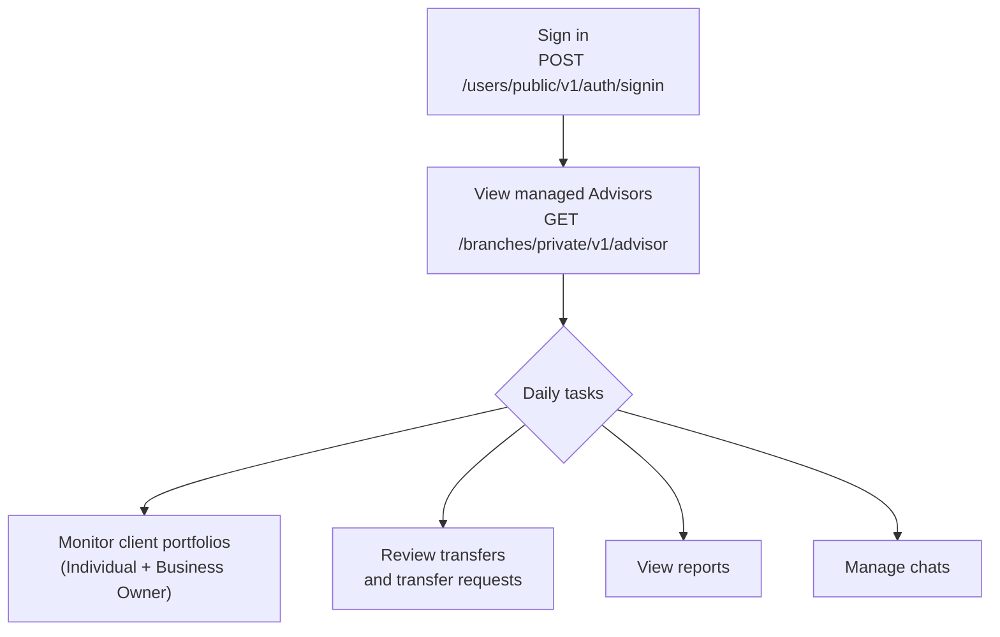

Head Branch Managers oversee Advisors and have full visibility across all client portfolios, transfers, and reports within their managed branches.

The Head Branch Manager sits between the Root Advisor and Branch Managers/Advisors in the admin hierarchy. They manage Advisors directly and have broad read access across all client activity — portfolios, accounts, transfers, auto-payments, and reports. They also have access to the chat module.

---

## Capabilities

- Create and manage **Advisor** accounts
- View all **Individual and Business Owner client portfolios** across managed branches
- View client **accounts and balances**
- View **transfer requests, transfers, and auto-payments** for all clients
- View **client and system reports**
- Access the **chat module**

> Head Branch Managers do not configure approval settings — that is scoped to Branch Managers.

---

## Daily Workflow



---

## Sign In

`POST /users/public/v1/auth/signin`

```json
{
  "login": "headbranch@yourorg.com",
  "password": "Password123!"
}
```

**Response:**

```json
{
  "data": {
    "accessToken": "eyJ...",
    "refreshToken": "LUF..."
  }
}
```

The `accessToken` expires after **30 minutes**. Refresh it with `POST /users/public/v1/auth/refresh`.

---

## Managing Advisors

Head Branch Managers can create and manage Advisor accounts within their branches.

**List Advisors:**

`GET /branches/private/v1/advisor`

- **Auth**: Head Branch Manager access token

```
GET /branches/private/v1/advisor?page[number]=1&page[size]=20
Authorization: Bearer <head_branch_manager_token>
```

Filter by branch to see Advisors in a specific branch:

```
GET /branches/private/v1/advisor?filter[branchID]=eq:<branch-uuid>&page[number]=1&page[size]=20
```

> Creating and editing Advisor accounts is covered in the full API Reference section.

---

## Viewing Client Portfolios

**List Individual clients (all branches):**

`GET /branches/private/v1/individual`

- **Auth**: Head Branch Manager access token

**Get a single Individual client:**

`GET /branches/private/v1/individual/{id}`

- **Auth**: Head Branch Manager access token

---

## Access Summary

| Resource                  | Head Branch Manager access |
|---------------------------|---------------------------|
| Branches                  | Read                      |
| Head Branch Managers      | —                         |
| Branch Managers           | —                         |
| Advisors                  | Read / Write              |
| Individual clients        | Read / Write              |
| Business Owner clients    | Read / Write              |
| Transfer requests         | Read                      |
| Transfers                 | Read                      |
| Auto-payments             | Read                      |
| Reports                   | Read                      |
| Approval settings         | —                         |
| Chats                     | Read / Write              |
