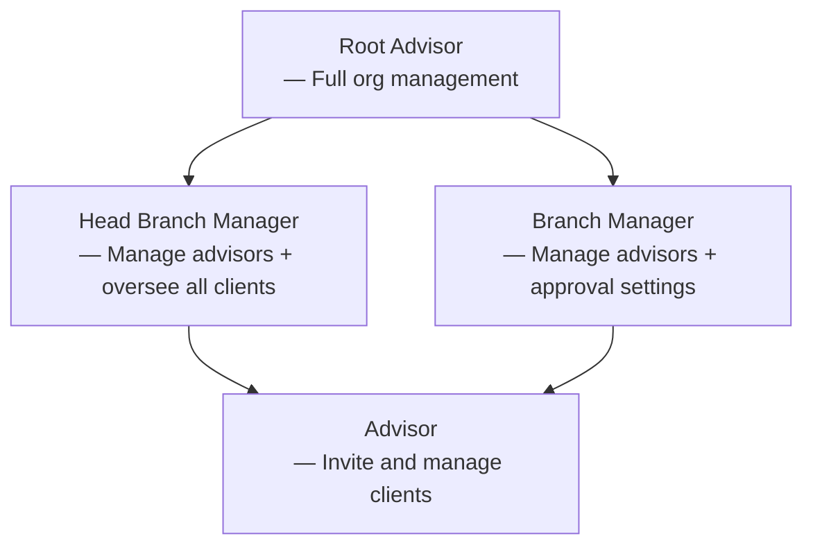

The admin layer of TAPP Cash gives your organization full programmatic control over its internal structure and client operations — from the Root Advisor at the top down to the front-line Advisor, each role has a defined scope covering branches, portfolios, transfers, and reports.

---

## Admin Roles

<Cards>
  <Card title="Root Advisor" href="./root-advisor" icon="fa-duotone fa-crown">The top-level admin. Sets up the organization's full structure — branches, admin tiers, and Advisors — and has visibility across every client portfolio and report.</Card>
  <Card title="Head Branch Manager" href="./head-branch-manager" icon="fa-duotone fa-user-shield">Manages Advisors and has full oversight of all client activity — portfolios, transfers, auto-payments, and reports. Has chat access.</Card>
  <Card title="Branch Manager" href="./branch-manager" icon="fa-duotone fa-user-gear">Manages Advisors within a branch and configures approval settings — can require sign-off on client transfer requests before they execute.</Card>
  <Card title="Advisor" href="./advisor" icon="fa-duotone fa-user-tie">The front-line admin role. Invites Individual and Business Owner clients, monitors their onboarding, and oversees their account activity.</Card>
</Cards>

---

## Resources

<Cards>
  <Card title="Roles & Permissions" href="./roles" icon="fa-duotone fa-shield-halved">Full access control matrix — which resources each admin role can read or write.</Card>
  <Card title="Branches" href="./branches" icon="fa-duotone fa-code-branch">Branch structure and how approval settings work per branch.</Card>
  <Card title="Client Portfolios" href="./clients" icon="fa-duotone fa-users">View and manage Individual and Business Owner clients across the branch network.</Card>
  <Card title="Transfers & Auto-Payments" href="./transfers" icon="fa-duotone fa-arrow-right-arrow-left">Monitor transfer requests, transfers, and auto-payment schedules.</Card>
  <Card title="Reports" href="./reports" icon="fa-duotone fa-chart-bar">Client-level and system-level reports for all portfolios.</Card>
</Cards>

---

## Admin Hierarchy

Each level inherits a progressively narrower scope. The Root Advisor has access to every resource in the organization; Advisors are scoped to their own branch and client portfolios.

---

## Role Summary

| Role                    | Branches | Admin Users | Client Portfolios | Transfers | Approval Settings |
|-------------------------|:--------:|:-----------:|:-----------------:|:---------:|:-----------------:|
| **Root Advisor**        | ✓        | ✓           | ✓ (all)           | View      | —                 |
| **Head Branch Manager** | —        | Advisors    | ✓ (all)           | View      | —                 |
| **Branch Manager**      | —        | Advisors    | ✓ (branch)        | Requests  | ✓                 |
| **Advisor**             | —        | —           | ✓ (own)           | View      | —                 |
