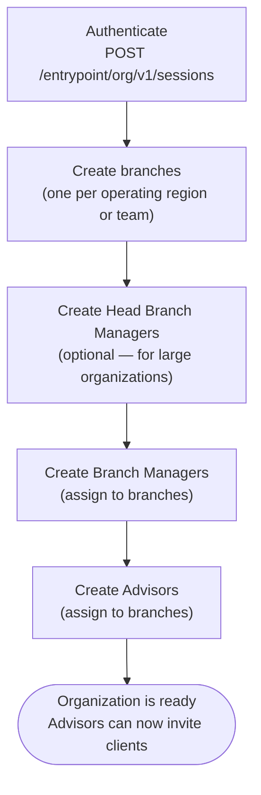

The Root Advisor is the highest admin role in TAPP Cash — one per organization, created by the TAPP Cash team at onboarding — with full access to create and manage all other admin users, branches, client portfolios, and reports.

---

## Capabilities

- Create and manage **branches** that group advisors and their client portfolios
- Create and manage **Head Branch Managers** and **Branch Managers**
- Create and manage **Advisors** directly
- View **all client portfolios** — Individual and Business Owner — across every branch in the organization
- View **all accounts, balances, transfers, transfer requests, and auto-payments**
- View **all reports** — client-level and system-level — across the entire organization
- Full read/write access to all admin resources

---

## First-Time Setup Workflow

After receiving credentials from `support@tappcash.com`, the Root Advisor sets up the organization's structure before any clients can be invited.



Branches, Head Branch Managers, Branch Managers, and Advisors can be created in any order, but creating branches first makes it easier to assign admin users to them during creation.

---

## Step 1 — Authenticate

Use your `clientId` and `clientSecret` to create a session. See [Authentication](/docs/authentication) for the full flow.

```
POST /entrypoint/org/v1/sessions
X-Client-Id: <clientId>
```

All subsequent requests must include `X-Session-Id` and `X-Client-Id` headers.

---

## Step 2 — Build Your Admin Hierarchy

Create your organization's admin structure. The depth of the hierarchy depends on your organization's size — a small integration may use only branches and Advisors; a large one may use the full four-tier hierarchy.

**Typical setup sequence:**

| Action | Who performs it |
|--------|-----------------|
| Create branches | Root Advisor |
| Create Head Branch Managers | Root Advisor |
| Create Branch Managers | Root Advisor |
| Create Advisors | Root Advisor, Head Branch Manager, or Branch Manager |
| Invite clients | Advisor |

> Detailed API calls for creating Head Branch Managers, Branch Managers, and Advisors are covered in the full API Reference section.

---

## Step 3 — Monitor the Organization

Once the hierarchy is set up and Advisors start inviting clients, the Root Advisor can monitor the entire organization:

**List all Advisors:**

`GET /branches/private/v1/advisor`

- **Auth**: Root Advisor access token

```
GET /branches/private/v1/advisor?page[number]=1&page[size]=20
X-Session-Id: <sessionId>
X-Client-Id:  <clientId>
```

**List Individual clients across all branches:**

`GET /branches/private/v1/individual`

- **Auth**: Root Advisor access token
- Returns clients across all branches (not scoped to a single advisor)

---

## Session Handling

Sessions expire after **24 hours**. When you receive `401`, create a new session via `POST /entrypoint/org/v1/sessions` and retry the request.

---

## Full Access Summary

| Resource                  | Root Advisor access |
|---------------------------|---------------------|
| Branches                  | Read / Write        |
| Head Branch Managers      | Read / Write        |
| Branch Managers           | Read / Write        |
| Advisors                  | Read / Write        |
| Individual clients        | Read / Write        |
| Business Owner clients    | Read / Write        |
| Transfer requests         | Read                |
| Transfers                 | Read                |
| Auto-payments             | Read                |
| Reports (all)             | Read                |
| Approval settings         | Read                |
