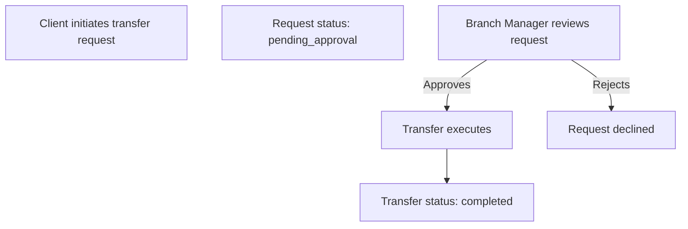

Admin roles have visibility into their clients' money movement activity. Depending on your role, you can view transfer requests, completed transfers, and auto-payment schedules for both Individual and Business Owner portfolios.

---

## Transfer vs. Transfer Request

| Concept             | Description                                                                                          |
|---------------------|------------------------------------------------------------------------------------------------------|
| **Transfer Request** | A pending money movement initiated by a client. May require Branch Manager approval before executing — depending on your branch's [approval settings](./branches). |
| **Transfer**         | A completed or in-progress money movement. Includes both internal TBA transfers and ACH transactions. |
| **Auto-Payment**     | A recurring scheduled transfer set up by a client or Operator. Runs automatically on the configured frequency. |

---

## Admin Visibility by Role

| Role                    | Transfer Requests | Transfers | Auto-Payments |
|-------------------------|:-----------------:|:---------:|:-------------:|
| **Root Advisor**        | View              | View      | View          |
| **Head Branch Manager** | View              | View      | View          |
| **Branch Manager**      | View              | —         | —             |
| **Advisor**             | View              | View      | View          |

> Admin roles view transfer activity — they do not initiate transfers on behalf of clients.

---

## Transfer Request Approval Flow

When a branch has `is_bm_approval_required: true`, client transfer requests follow this flow:

The Branch Manager receives the request in their transfer requests queue and can approve or reject it before the funds move.

---

## Client-Side Transfer Types

These are the transfer types your clients can initiate. Admin roles view these as read-only.

| Type              | Direction                        | Who can use                          |
|-------------------|----------------------------------|--------------------------------------|
| **TBA (Internal)**| Checking ↔ Savings               | Individual, Business Owner, Operator |
| **ACH**           | External bank ↔ Checking/Savings | Individual, Business Owner, Operator |
| **Auto-Payment**  | Scheduled recurring ACH or TBA   | Individual, Business Owner, Operator |

> See [Move Money](../individual-user/move-money) for the client-side transfer API calls.
