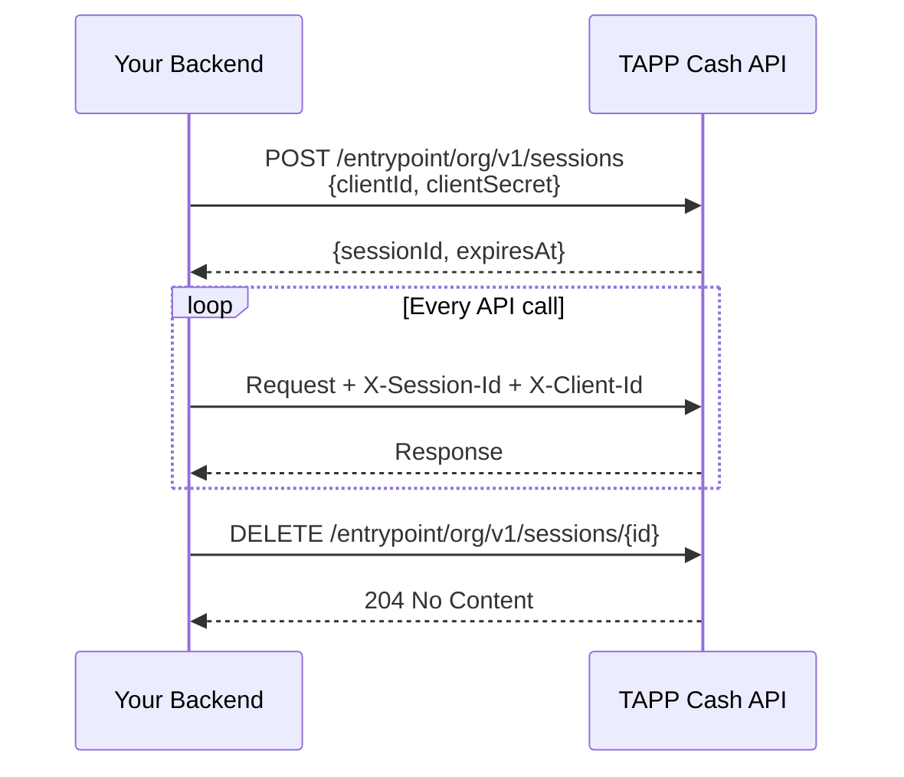

All requests to the TAPP Cash API use **session-based authentication**. You obtain a `sessionId` by exchanging your `clientId` and `clientSecret`, then pass it on every request via headers.

---

## Required Headers

```
X-Session-Id: <sessionId>
X-Client-Id:  <clientId>
```

Both headers are required on every authenticated endpoint. The gateway verifies that the `sessionId` was issued to the supplied `clientId` — a session from one credential cannot be used with another.

---

## Getting a Session

`POST /entrypoint/org/v1/sessions`

```json
{
  "clientId": "ci_test_3f7a9c2e-1234-5678-abcd-ef0123456789",
  "clientSecret": "cs_test_AbCdEf123..."
}
```

**Response:**

```json
{
  "data": {
    "sessionId": "550e8400-e29b-41d4-a716-446655440000",
    "expiresAt": "2026-06-22T10:00:00Z"
  }
}
```

Sessions are valid for **24 hours**. Reuse the `sessionId` across requests until it expires or you revoke it.

---

## Session Lifecycle



---

## Revoking a Session

`DELETE /entrypoint/org/v1/sessions/{id}`

```
X-Session-Id: 550e8400-e29b-41d4-a716-446655440000
X-Client-Id:  ci_test_3f7a9c2e-1234-5678-abcd-ef0123456789
```

Call this on user logout or when a job completes. Sessions that are not explicitly revoked expire automatically after 24 hours.

---

## Credentials

Credentials are issued by `support@tappcash.com` and are environment-specific:

| ClientId prefix | ClientSecret prefix | Environment |
|-----------------|---------------------|-------------|
| `ci_test_` | `cs_test_` | Sandbox |
| `ci_live_` | `cs_live_` | Production |

The `clientSecret` is shown **once** at creation. Store it in a secrets manager — it cannot be retrieved again.

---

## Authentication Errors

| Status | Meaning | Fix |
|--------|---------|-----|
| `401` | Invalid `clientId` or `clientSecret` | Check credentials |
| `401` | Session expired or not found | Create a new session |
| `401` | `clientId` / `sessionId` mismatch | Ensure both headers match the same credential |
| `403` | API access not enabled | Contact `support@tappcash.com` |
| `403` | IP not whitelisted | Contact `support@tappcash.com` to update your IP whitelist |
| `403` | Credential revoked | A new credential must be issued |
