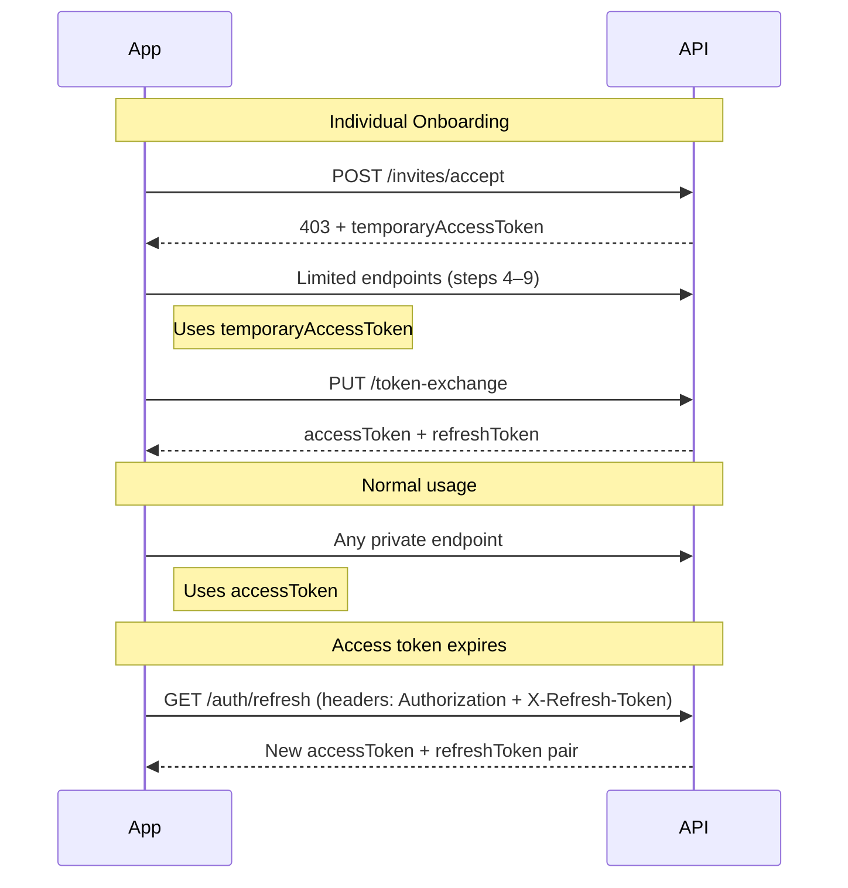

Every request to a private endpoint requires a valid Bearer token in the `Authorization` header — covering token types, issuance, refresh, and the full token lifecycle.

```
Authorization: Bearer <your_token>
```

---

## Token Types

TAPP Cash uses two token types depending on where the user is in the flow.

| Token | Lifetime | Used for |
|-------|----------|----------|
| `accessToken` | ~10 minutes | All private API calls after sign-in or token exchange |
| `refreshToken` | ~35 minutes | Obtaining a new `accessToken` without re-login |
| `temporaryAccessToken` | Session | Individual user onboarding steps 4–9 only |

> **Note:** Actual lifetimes may be shorter if your organization has auto-logout enabled in settings. The values above are the platform defaults.

---

## Token Lifetime by Account Type

Lifetimes vary by account type:

| Account type | `accessToken` lifetime | `refreshToken` lifetime |
|---|---|---|
| Root account | 30 minutes | 7 days |
| All other accounts (admin roles, individual, business) | ~10 minutes (default) | ~35 minutes (default) |

The **Root account** (`administrator@<your-org>.com`) is granted extended token lifetimes to support API automation and long-running integrations. All other user types — advisors, branch managers, individual customers, business owners, and operators — use the standard short-lived defaults.

---

## Sign In

`POST /users/public/v1/auth/signin`

```json
{
  "login": "user@example.com",
  "password": "YourPassword123!",
  "roles": ["individual"]
}
```

**Response:**

```json
{
  "data": {
    "accessToken": "eyJ...",
    "refreshToken": "LUF..."
  }
}
```

Pass the role that matches the user type signing in: `root`, `superadvisor`, `branchmanager`, `advisor`, `individual`, `businessowner`, or `businessoperator`.

---

## Refresh an Expired Access Token

`GET /users/public/v1/auth/refresh`

Pass both tokens as request headers — no request body required:

```
Authorization: Bearer <accessToken>
X-Refresh-Token: <refreshToken>
```

Returns a new `accessToken` and `refreshToken` pair. Call this automatically when any private endpoint returns `401`. Do not prompt the user to re-login unless the refresh token itself has also expired.

> **Important — single-use tokens:** Each refresh call immediately invalidates the old access token and refresh token. Save the new pair and discard the old one. Re-using old tokens after a successful refresh returns `401`.

---

## Get Current User Profile

`GET /users/private/v1/auth/me`

Returns the authenticated user's full profile using the current access token. Useful for confirming token validity and loading user context on app launch.

---

## Token Lifecycle



---

## Token Scopes

| Token | Accessible endpoints |
|-------|---------------------|
| Account manager `accessToken` | `/branches/private/*` — manage individuals, send invitations |
| Individual `accessToken` | `/accounts/private/*`, `/notifications/private/*`, `/kyc/private/*`, `/branches/private/v1/delete-profile*` |
| `temporaryAccessToken` | `/branches/private/v1/limited/*`, `/users/private/v1/limited/*` — onboarding steps only |

---

## Authentication Errors

| Status | Meaning | Fix |
|--------|---------|-----|
| `401` | Missing or expired `accessToken` | Refresh with `GET /auth/refresh` |
| `401` | Invalid `refreshToken` | Token expired — user must sign in again |
| `403` | Valid token but wrong role or endpoint | Check token type and endpoint visibility (`public` vs `private`) |
