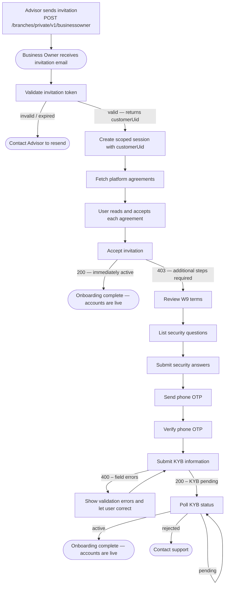

Business Owner onboarding begins with an Advisor invitation and ends with KYB approval — Business Owners submit Know Your Business (KYB) documentation verifying the business entity and its beneficial owners, unlike Individual users who complete personal KYC.

---

## Onboarding Flow



---

## Step 1 — Validate Invitation Token

`GET /branches/public/v1/common/invites/check?token=<invite_token>`

- **Auth**: None

The invitation email contains a token. Validate it before showing any onboarding UI.

```json
{
  "data": {
    "role": "businessowner",
    "customerUid": "a1b2c3d4-0000-0000-0000-000000000001"
  }
}
```

If the request returns an error the token has expired or already been used — the Business Owner should ask their Advisor to send a new invitation.

---

## Create a Scoped Session (before Step 3)

Use the `customerUid` from Step 1 to open a session for this user:

`POST /entrypoint/org/v1/sessions`

```json
{
  "clientId":     "<your-client-id>",
  "clientSecret": "<your-client-secret>",
  "customerUid":  "<customerUid from Step 1>"
}
```

```json
{
  "data": {
    "sessionId": "4bdfca21-461e-45a2-9d26-64f4176267c7",
    "expiresAt": "2026-06-24T12:00:00Z"
  }
}
```

Include these headers on **every request from Step 3 onward**:

```
X-Session-Id: <sessionId>
X-Client-Id:  <clientId>
```

---

## Step 2 — Fetch Platform Agreements

`GET /branches/public/v1/common/agreements`

- **Auth**: None

Retrieve the list of agreements the Business Owner must accept before proceeding. Display each agreement; all must be acknowledged to continue.

---

## Step 3 — Accept Invitation

`POST /branches/public/v1/businessowner/invites/accept?token=<invite_token>`

- **Auth**: Session headers
- No request body required.

| HTTP | Meaning |
|------|---------|
| `200` | Account is immediately active — onboarding complete. |
| `403` | Account created; continue with Steps 4–10. |

---

## Step 4 — Review W9 Terms

`GET /branches/private/v1/limited/w9/terms`

- **Auth**: Session headers

Display the W9 tax certification text. Record the timestamp of user acceptance for use in Step 9.

---

## Step 5 — List Security Questions

`GET /users/private/v1/limited/security-questions`

- **Auth**: Session headers

Present the available questions for the user to choose from.

---

## Step 6 — Submit Security Answers

`POST /users/private/v1/limited/security-questions/answers`

- **Auth**: Session headers. Exactly 3 distinct question IDs required.

```json
{
  "answers": [
    { "questionId": 1, "answer": "Seattle" },
    { "questionId": 5, "answer": "Buddy" },
    { "questionId": 9, "answer": "Blue" }
  ]
}
```

---

## Step 7 — Send Phone OTP

`POST /users/private/v1/limited/generate-new-phone-code`

- **Auth**: Session headers

Triggers an SMS to the phone number registered during invitation.

---

## Step 8 — Verify Phone OTP

`PUT /users/private/v1/limited/check-phone-code`

- **Auth**: Session headers

```json
{ "code": "ABC12" }
```

On success, the phone number is confirmed.

---

## Step 9 — Submit KYB Information

`POST /branches/private/v1/limited/businessowner/signup`

- **Auth**: Session headers
- **On success (200)**: KYB submitted — account enters `pending` review.
- **On error (400)**: Check `errors` array for field-level failures, correct and resubmit.

Submit the business entity details and all beneficial owners (individuals who own 25% or more of the business).

```json
{
  "businessName": "Acme Corp",
  "businessType": "LLC",
  "taxId": "12-3456789",
  "address": {
    "address": "123 Main St",
    "city": "Austin",
    "state": "TX",
    "zipCode": "78701",
    "country": "USA"
  },
  "w9": {
    "isSubjectToBackupWithholding": false,
    "accepted": true,
    "timestamp": "2024-03-15T14:22:00Z"
  },
  "beneficialOwners": [
    {
      "firstName": "Jane",
      "lastName": "Doe",
      "dateOfBirth": "06/15/1985",
      "ownershipPercentage": 51
    }
  ]
}
```

---

## Step 10 — Poll KYB Status

`GET /branches/private/v1/limited/businessowner/kyb-status`

- **Auth**: Session headers

Poll this endpoint after Step 9 to track the review outcome.

| Status | Meaning |
|--------|---------|
| `pending` | KYB submitted, review in progress |
| `active` | KYB approved — accounts are fully usable |
| `rejected` | KYB rejected — contact support |

The session used during onboarding remains valid throughout the KYB review period.
