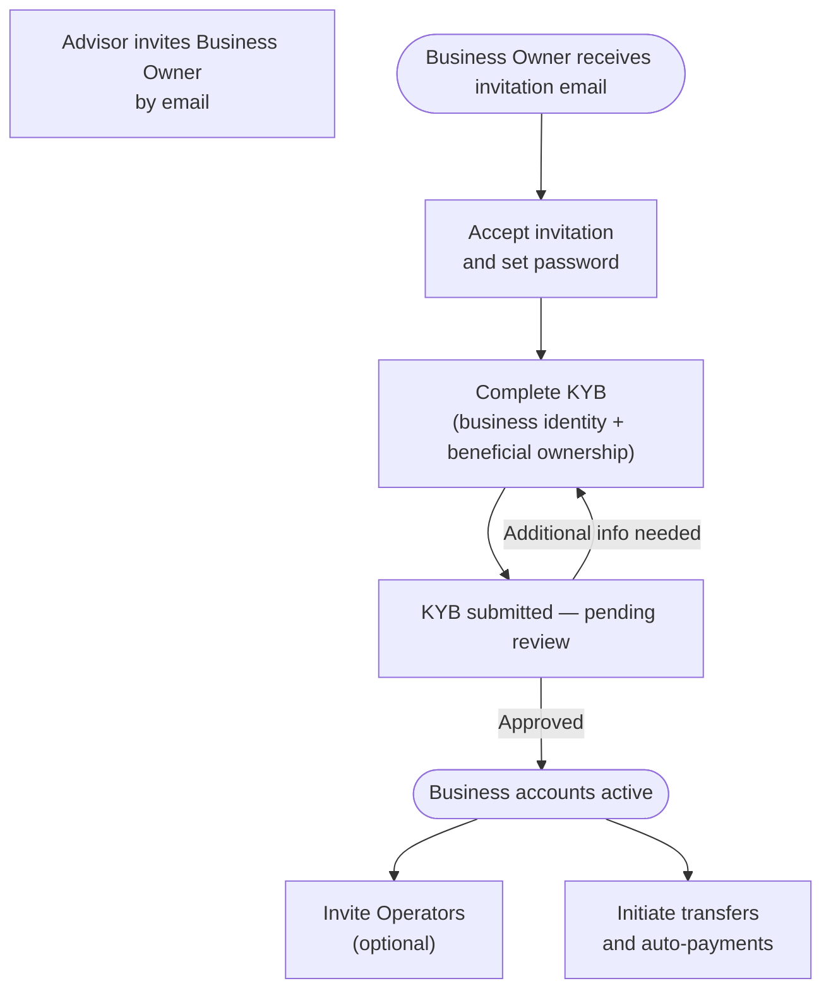

Everything a Business Owner can do after receiving an Advisor's invitation — from completing KYB verification through daily business banking operations including accounts, money movement, and managing Operators.

---

## What can you do?

<Cards>
  <Card title="Registration & KYB" href="/docs/business-registration" icon="fa-duotone fa-building-circle-check">Accept your invitation, complete Know Your Business (KYB) verification including beneficial ownership, and activate your business accounts.</Card>
  <Card title="Accounts & Balances" href="/docs/business-accounts" icon="fa-duotone fa-wallet">View your business accounts, check balances, and access account details.</Card>
  <Card title="Move Money" href="/docs/business-move-money" icon="fa-duotone fa-money-bill-transfer">Internal transfers between business accounts (TBA), ACH pulls and pushes to external bank accounts, and automated recurring payments.</Card>
  <Card title="Manage Operators" href="/docs/operators" icon="fa-duotone fa-users-gear">Invite team members as Operators to manage your business accounts on your behalf, with configurable permissions per Operator.</Card>
</Cards>

---

## Business Owner Onboarding Journey

---

## Key Differences from Individual Users

| Aspect        | Individual                    | Business Owner                              |
|---------------|-------------------------------|---------------------------------------------|
| Verification  | KYC (personal identity)       | KYB (business identity + beneficial owners) |
| Account type  | Personal checking and savings | Business accounts                           |
| Delegation    | —                             | Can invite Operators to manage accounts     |
| Permissions   | Full self-service             | Grants per-Operator permissions             |
