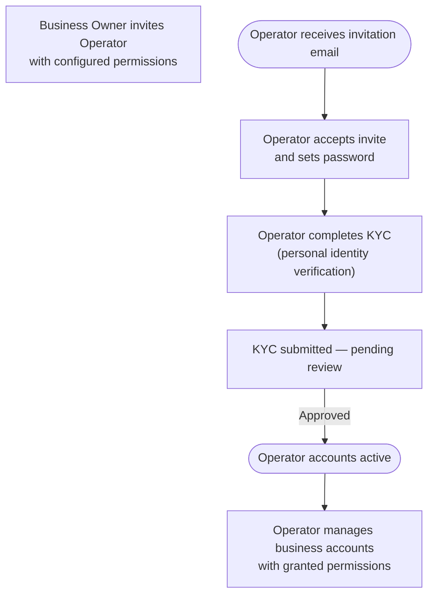

Business Owners can invite Operators — team members who manage the business's accounts and initiate transactions on the owner's behalf. Each Operator is granted specific permissions that define what they can do.

---

## Operator Permissions

When inviting an Operator, the Business Owner configures two independent permissions:

| Permission      | What it allows                                               |
|-----------------|--------------------------------------------------------------|
| `transferFunds` | Initiate TBA internal transfers and ACH external transfers   |
| `autoPay`       | Create, update, and delete auto-payment schedules            |

Operators without a permission receive `403 Forbidden` when they attempt the corresponding action. Permissions can be updated at any time by the Business Owner.

---

## Operator Onboarding Flow



> Operators complete KYC (personal identity verification), not KYB. The business itself is already verified through the Business Owner's KYB.

---

## Invite an Operator

`POST /branches/private/v1/operator`

- **Auth**: Business Owner access token

```json
{
  "firstName": "Sam",
  "lastName": "Lee",
  "email": "sam.lee@business.com",
  "phoneNumber": "+14155550123",
  "permissions": {
    "transferFunds": true,
    "autoPay": false
  }
}
```

On success, an invitation email is sent to the Operator. Their account is created with `status: "invited"`.

---

## List Operators

`GET /branches/private/v1/operator`

- **Auth**: Business Owner access token

Returns a paginated list of all Operators invited by this Business Owner.

```
GET /branches/private/v1/operator?page[number]=1&page[size]=20
Authorization: Bearer <business_owner_token>
```

**Response (abbreviated):**

```json
{
  "data": [
    {
      "id": "op-uuid-1",
      "firstName": "Sam",
      "lastName": "Lee",
      "email": "sam.lee@business.com",
      "status": "active",
      "permissions": {
        "transferFunds": true,
        "autoPay": false
      }
    }
  ],
  "meta": {
    "totalRecord": 3,
    "totalPage": 1,
    "pageNumber": 1,
    "limit": 20
  }
}
```

---

## Update Operator Permissions

`PUT /branches/private/v1/operator/{id}`

- **Auth**: Business Owner access token

Update the permissions for an existing Operator at any time.

```json
{
  "permissions": {
    "transferFunds": true,
    "autoPay": true
  }
}
```

---

## Operator Status Lifecycle

| Status     | Description                                                    |
|------------|----------------------------------------------------------------|
| `invited`  | Invitation sent; Operator has not yet accepted                 |
| `pending`  | Operator has accepted and submitted KYC — awaiting review      |
| `active`   | KYC approved; Operator has full access per their permissions   |
| `inactive` | Operator has been deactivated by the Business Owner            |
| `dormant`  | Operator account inactive for an extended period               |
| `deleted`  | Operator removed from the business account                     |

---

## Deactivate or Remove an Operator

Business Owners can deactivate or delete an Operator at any time. A deactivated Operator loses access immediately — all in-progress requests using their token return `403 Forbidden`.

> See the [Operator](../operator) guide for the complete Operator-side API reference.
