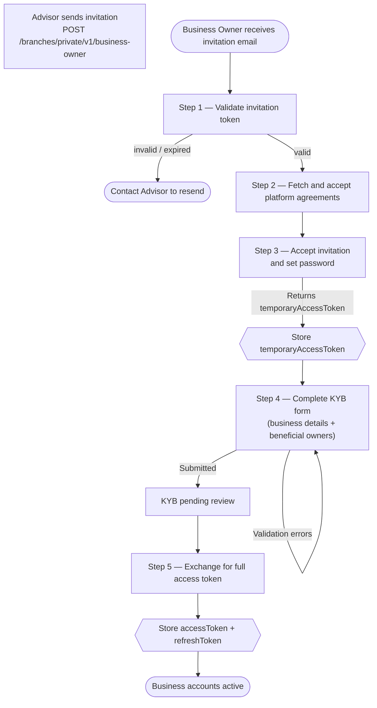

How a Business Owner accepts an invitation, completes KYB verification, and activates their business accounts.

Business Owner onboarding begins with an Advisor invitation and ends with KYB approval. Unlike Individual users who complete personal KYC, Business Owners submit Know Your Business (KYB) documentation that verifies the business entity and its beneficial owners.

---

## Onboarding Flow



---

## Step 1 — Validate Invitation Token

`GET /branches/public/v1/common/invites/check`

The invitation email contains a token. Check its validity before proceeding.

```
GET /branches/public/v1/common/invites/check?token=<invite_token>
```

**Response:**

```json
{
  "data": {
    "valid": true,
    "email": "owner@business.com"
  }
}
```

If `valid` is `false` or the request returns an error, the token has expired or already been used. The Business Owner should ask their Advisor to send a new invitation.

---

## Step 2 — Fetch Platform Agreements

`GET /branches/public/v1/common/agreements`

Retrieve the list of agreements the Business Owner must accept before proceeding.

```json
{
  "data": [
    {
      "id": "1",
      "title": "Terms of Service",
      "url": "https://..."
    }
  ]
}
```

Display each agreement to the user. All must be accepted to continue.

---

## Step 3 — Accept Invitation and Set Password

`POST /branches/public/v1/business-owner/invites/accept`

Submit the invite token, accepted agreement IDs, and chosen password.

```json
{
  "token": "<invite_token>",
  "password": "SecurePassword123!",
  "agreements": ["1", "2"]
}
```

**Response:** Returns a `temporaryAccessToken` (HTTP 403 scope). Store this token — it is used for the KYB submission step.

```json
{
  "data": {
    "temporaryAccessToken": "eyJ..."
  }
}
```

---

## Step 4 — Complete KYB

`POST /branches/private/v1/business-owner/kyb`

- **Auth**: `temporaryAccessToken` from Step 3

Submit the business entity details and beneficial owner information.

**Business details:**

```json
{
  "businessName": "Acme Corp",
  "businessType": "LLC",
  "taxId": "12-3456789",
  "address": {
    "address": "123 Main St",
    "city": "Austin",
    "state": "TX",
    "zipCode": "78701",
    "country": "US"
  },
  "beneficialOwners": [
    {
      "firstName": "Jane",
      "lastName": "Doe",
      "dateOfBirth": "1985-06-15",
      "ownershipPercentage": 51
    }
  ]
}
```

Beneficial owners are individuals who own 25% or more of the business. Include all qualifying owners.

---

## Step 5 — Exchange for Full Access Token

`POST /users/private/v1/limited/token-exchange`

- **Auth**: `temporaryAccessToken`

Once KYB is submitted, exchange the temporary token for a full `accessToken` and `refreshToken`.

```json
{
  "data": {
    "accessToken": "eyJ...",
    "refreshToken": "LUF..."
  }
}
```

Store both tokens. The `accessToken` expires after **30 minutes**; use `POST /users/public/v1/auth/refresh` to renew it.

---

## KYB Review

After submission, KYB enters a review state. The platform team verifies the business entity and beneficial ownership details.

| Status      | Meaning                                                              |
|-------------|----------------------------------------------------------------------|
| `pending`   | KYB submitted and under review                                       |
| `approved`  | Verification passed — business accounts are fully active             |
| `rejected`  | Verification failed — Business Owner will be contacted for next steps|

The Business Owner can sign in and use limited features while KYB is pending. Full account access (transfers, external accounts) requires KYB approval.
