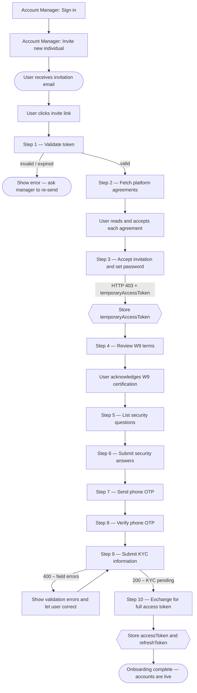
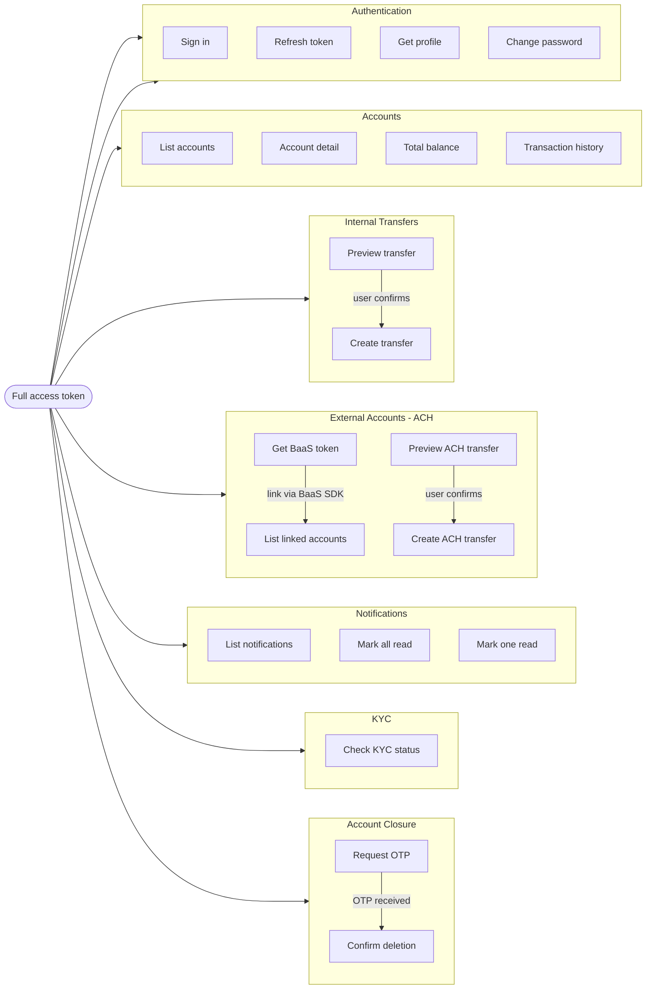
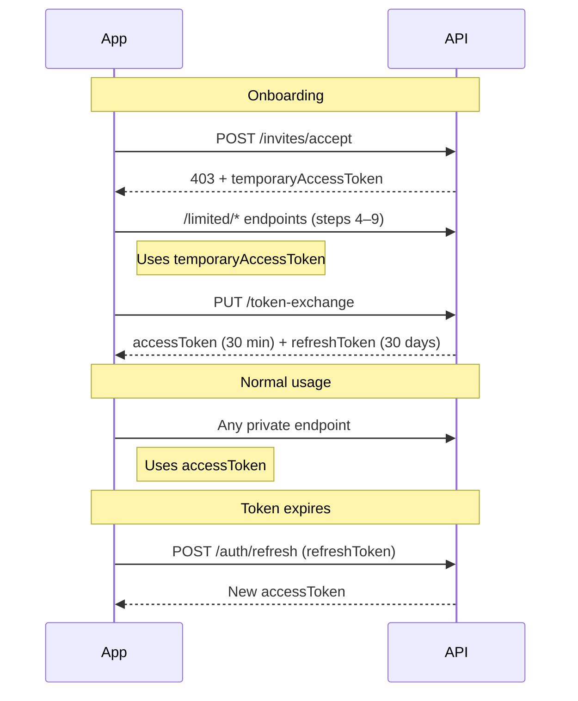

## What you can build

- **Onboard individuals** — Invite users via email, guide them through KYC, and issue them live financial accounts automatically
- **Move money** — Internal transfers between accounts (TBA) and ACH pulls/pushes to external bank accounts
- **Show account activity** — Real-time balances, transaction history, and notifications
- **Manage your portfolio** — As an account manager, view and invite all individuals under your branch

## How to use these docs

| Section           | What it covers                                                       |
| ----------------- | -------------------------------------------------------------------- |
| **Guide**         | Step-by-step walkthrough of the full user journey with code examples |
| **Recipes**       | Copy-paste curl commands for every common task                       |
| **API Reference** | Full endpoint specs — parameters, request bodies, and responses      |

## Getting started

Start with the **Guide** — it walks through the complete flow from the account manager sending an invitation to the user completing onboarding and making their first transfer.

**Base URL:** `https://api-test.stage2.tappbank.com` (staging)

> All requests must include `Content-Type: application/json`. Authenticated endpoints require `Authorization: Bearer <token>` in the header.

# Individual User Integration Guide

This guide walks you through the complete lifecycle of an individual user on the TaPP platform — from the account manager sending the first invitation through onboarding, daily banking, and account closure. Follow the sections in order for a first integration; jump to any section once you are familiar with the flow.

***

## Application Flow Overview

### Full Journey (Manager → Individual User)



***

### Post-Onboarding Feature Map



***

### Token Lifecycle



***

## Prerequisites

| Item          | Details                                          |
| ------------- | ------------------------------------------------ |
| Base URL      | `https://api-test.stage2.tappbank.com` (staging) |
| Content-Type  | `application/json` for all requests              |
| Authorization | `Authorization: Bearer <token>` header           |

***

## Account Manager

The journey starts with the account manager (advisor), not the individual user. The manager signs in, optionally reviews their portfolio of individuals, then sends an invitation email that starts the onboarding flow.

### Sign in as an account manager

`POST /users/public/v1/auth/signin`

```json
{
  "login": "manager@example.com",
  "password": "YourPassword123!",
  "roles": ["advisor"]
}
```

Returns `accessToken` (30 min) and `refreshToken` (30 days). Use the `accessToken` in all subsequent Account Manager calls.

> **Note:** Do not include `roles` when signing in as an individual user. Pass `["individual"]` or omit the field entirely — the platform determines the role from the account.

### List managed individuals

`GET /branches/private/v1/individual`

- **Auth**: Account manager access token
- Returns a paginated list of all individuals under this manager's branch.
- **Pagination**: `page[size]` and `page[number]` (default: 20 per page).

```
GET /branches/private/v1/individual?page[number]=1&page[size]=20
Authorization: Bearer <manager_token>
```

Response shape (abbreviated):

```json
{
  "data": [
    {
      "id": "cba69452-3767-47cc-9b54-1d82a3549741",
      "firstName": "Jane",
      "lastName": "Doe",
      "email": "jane.doe@example.com",
      "phoneNumber": "+12025550191",
      "status": "active",
      "currentTier": { "id": 21, "name": "Entry", "level": 0 }
    }
  ],
  "meta": {
    "totalRecord": 127,
    "totalPage": 7,
    "pageNumber": 1,
    "limit": 20
  }
}
```

### View an individual's full profile

`GET /branches/private/v1/individual/{id}`

- **Auth**: Account manager access token
- `{id}` is the individual's UUID returned by the list endpoint.

### Send an invitation to a new individual

`POST /branches/private/v1/individual`

- **Auth**: Account manager access token
- This is what triggers the invitation email to the user. Once sent, the user follows Steps 1–10 below.

```json
{
  "firstName": "Jane",
  "lastName": "Doe",
  "email": "jane.doe@example.com",
  "phoneNumber": "+12025550191"
}
```

On success (`200`), the individual record is created with `status: "invited"` and the invitation email is dispatched automatically.

***

## Part 1 — Onboarding

### Step 1: Validate the invitation token

Before rendering any UI, confirm the invite link is still valid.

`GET /branches/public/v1/common/invites/check?token=<invite_token>`

- **Auth**: None
- **On success (200)**: The token is valid — proceed to step 2.
- **On error (400/404)**: Show "Invitation expired or not found."

***

### Step 2: Fetch platform agreements

Retrieve the list of legal agreements the user must accept.

`GET /branches/public/v1/common/agreements`

- **Auth**: None
- Display each agreement's title and content. Require the user to tick an "I agree" checkbox for each one before enabling the "Continue" button.

***

### Step 3: Accept the invitation

This is the most important step — it creates the user account and returns a **temporary access token**.

`POST /branches/public/v1/individual/invites/accept`

```json
{
  "token": "<invite_token>",
  "password": "SecurePassword#2024",
  "confirmPassword": "SecurePassword#2024",
  "agreementIds": [1, 2, 3]
}
```

**On success (403 with body):**

```json
{
  "data": { "temporaryAccessToken": "eyJ..." },
  "errors": [
    {
      "code": "required additional actions",
      "meta": { "fields": ["phoneNumber", "kyc"] }
    }
  ]
}
```

> **Important:** HTTP 403 here is intentional. Extract `data.temporaryAccessToken` and store it in memory. You will use it for steps 4–9.

The `meta.fields` array tells you which onboarding steps are still required:

- `phoneNumber` → steps 7–8 (phone OTP)
- `kyc` → step 9 (KYC signup)

***

### Step 4: Show W9 terms

`GET /branches/private/v1/limited/w9/terms`

- **Auth**: Temporary token
- Display the W9 tax certification text. Record the timestamp of user acceptance for step 9.

***

### Step 5: List security questions

`GET /users/private/v1/limited/security-questions`

- **Auth**: Temporary token
- Present 3 questions for the user to choose and answer.

***

### Step 6: Submit security answers

`POST /users/private/v1/limited/security-questions/answers`

```json
{
  "answers": [
    { "questionId": 1, "answer": "Seattle" },
    { "questionId": 5, "answer": "Buddy" },
    { "questionId": 9, "answer": "Blue" }
  ]
}
```

- **Auth**: Temporary token
- Exactly 3 distinct question IDs required.

***

### Step 7: Send phone OTP

`POST /users/private/v1/limited/generate-new-phone-code`

- **Auth**: Temporary token
- Triggers an SMS to the phone number registered during invitation.

***

### Step 8: Verify phone OTP

`PUT /users/private/v1/limited/check-phone-code`

```json
{ "code": "ABC12" }
```

- **Auth**: Temporary token
- On success, the phone is confirmed.

***

### Step 9: Submit KYC information

`POST /branches/private/v1/limited/individual/signup`

This is the most data-intensive step. Required fields:

```json
{
  "dateOfBirth": "1990-03-20",
  "socialSecurityNumber": "987-65-4321",
  "usCitizenshipStatus": "Citizen",
  "address": {
    "address": "123 Main Street",
    "city": "New York",
    "state": "NY",
    "zipCode": "10001",
    "country": "US"
  },
  "w9": {
    "isSubjectToBackupWithholding": false,
    "accepted": true,
    "timestamp": "2024-03-15T14:22:00Z"
  },
  "employment": {
    "status": "employed",
    "employer": "Acme Corp",
    "occupation": "Engineer"
  },
  "transferActivity": {
    "expectedMonthlyTransactions": 10,
    "expectedMonthlyVolume": "5000.00"
  }
}
```

- **Auth**: Temporary token
- **On success (200)**: KYC is submitted and being processed asynchronously.
- **On error (400)**: Check the `errors` array for field-level validation failures.

***

### Step 10: Exchange temporary token for full access

`PUT /users/private/v1/limited/token-exchange`

- **Auth**: Temporary token
- **On success (200)**:

```json
{
  "data": {
    "accessToken": "eyJ...",
    "refreshToken": "LUF..."
  }
}
```

Store the `accessToken` (30-minute lifetime) and `refreshToken` (30-day lifetime). Onboarding is now complete and the user's accounts are immediately available.

***

## Part 2 — Authentication

### Sign in (returning individual users)

`POST /users/public/v1/auth/signin`

```json
{
  "login": "jane.doe@example.com",
  "password": "SecurePassword#2024",
  "roles": ["individual"]
}
```

Returns `accessToken` and `refreshToken` on success.

> **Role values:** Pass `["individual"]` for end users, `["advisor"]` for account managers, or omit `roles` entirely — the platform resolves the role from the account record.

### Refresh an expired access token

`POST /users/public/v1/auth/refresh`

Pass the `refreshToken` to obtain a new `accessToken` without re-login.

### Get current user profile

`GET /users/private/v1/auth/me`

Returns the full user profile using the current access token.

***

## Part 3 — Accounts

### List accounts

`GET /accounts/private/v1/account`

Returns all accounts owned by the authenticated user. Accounts are created automatically during onboarding and are immediately visible after token exchange.

### Get account details

`GET /accounts/private/v1/account/{id}`

Returns the full account object including available balance, account type, and interest configuration.

### Total balance

`GET /accounts/private/v1/balance/total`

Returns the total available balance across accounts, plus pending incoming and pending outgoing amounts. Pass optional `accountIds` query param to filter to specific accounts.

### Transaction history

`GET /accounts/private/v1/transactions`

Returns a paginated list of transactions with status, amount, and counterparty information.

**Filtering by status**: Use `filter[status:eq]=executed` or `filter[status:in]=pending,executed`.

***

## Part 4 — Transfers Between Accounts (TBA)

Use TBA to move funds between two of the user's own internal accounts.

### 1. Preview the transfer

`POST /accounts/private/v1/tba-requests/preview`

```json
{
  "accountIdFrom": 1001,
  "accountIdTo": 1002,
  "outgoingAmount": "100.00"
}
```

The response shows the `incomingAmount` (amount credited after fees) and an itemized `details` array. Always show this preview screen to the user before confirming.

### 2. Submit the transfer

`POST /accounts/private/v1/tba-requests`

Same body as preview, plus optional `description`. On success the request starts in `pending` status and is executed asynchronously.

***

## Part 5 — External Account Linking (ACH)

External accounts allow users to pull funds from or send funds to their external bank accounts.

### 1. Get a BaaS authentication token

`POST /external-accounts/private/v1/baas/auth-token`

Returns a short-lived token to authenticate the user with the BaaS provider (e.g., Plaid). Pass this token to the BaaS SDK to launch the account linking flow.

### 2. List linked external accounts

`GET /external-accounts/private/v1/account`

Returns all linked external bank accounts with masked account numbers, routing numbers, and current status.

### 3. Preview an EXT transfer

`POST /accounts/private/v1/ext-requests/preview`

```json
{
  "fromAccountId": "1001",
  "toAccountId": "ext_acc_12345",
  "amount": "250.00"
}
```

The `fromAccountId` and `toAccountId` can be an internal account integer ID or an external account PKSUID string. To **pull funds in**, set `fromAccountId` to the external account and `toAccountId` to the internal account. To **push funds out**, reverse them.

### 4. Submit the EXT transfer

`POST /accounts/private/v1/ext-requests`

Same body as preview, plus optional `description`.

***

## Part 6 — Notifications

### List notifications

`GET /notifications/private/v1/notifications`

Returns the user's notification list. Each notification has an `isRead` flag and a `type` (e.g., `TRANSACTION_EXECUTED`).

### Mark all as read

`POST /notifications/private/v1/notifications/mark-all-read`

Call this after the user views the notification screen to clear the unread count.

### Mark a single notification as read

`DELETE /notifications/private/v1/notifications/{id}`

Marks one notification as read.

***

## Part 7 — KYC Status

### Check the latest KYC request

`GET /kyc/private/v1/requests/last`

Returns the user's most recent KYC request and its `status` (`pending`, `approved`, `rejected`, `incomplete`). If `isRequiredDocVer` is `true`, prompt the user to start the document verification process.

***

## Part 8 — Account Closure

Account closure is a two-step process to prevent accidental deletion.

### Step 1: Request an OTP

`POST /branches/private/v1/delete-profile-otp`

```json
{ "accountId": 1001 }
```

Pass `accountId` if a closure fee applies. The API validates eligibility and sends an OTP. If blockers exist (positive balance, pending transactions, insufficient funds for the fee), a `422` response is returned with the blocker codes.

### Step 2: Confirm deletion

`DELETE /branches/private/v1/delete-profile`

```json
{ "otp": "123456" }
```

Provide the OTP received in step 1. On success the user's profile and accounts are permanently closed.

***

## Error Handling Reference

All error responses use a consistent envelope:

```json
{
  "errors": [
    {
      "code": "ERROR_CODE",
      "title": "Human-readable summary",
      "details": "Additional context",
      "target": "field | common",
      "source": "fieldName"
    }
  ]
}
```

| HTTP Status | Meaning                                                          |
| ----------- | ---------------------------------------------------------------- |
| 400         | Validation or business rule failure — check `errors` array       |
| 401         | Missing or expired access token — refresh or re-login            |
| 403         | Forbidden — insufficient permissions or token type mismatch      |
| 404         | Resource not found                                               |
| 409         | Conflict — e.g., pending transactions block deletion             |
| 422         | Unprocessable — business logic rejection (see `code` for reason) |
| 500         | Internal server error — retry with exponential backoff           |

<br />
