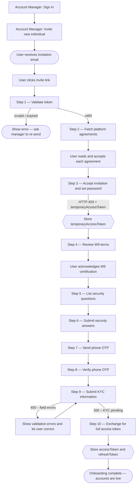

This section covers everything an individual user can do after receiving an account manager's invitation — from completing onboarding through daily banking operations.

---

## What can you do?

<strong>Onboarding</strong>  
Complete the 10-step flow: validate invite token, accept agreements, set password, W9, security questions, phone OTP, KYC, and token exchange. See <a href="./registration">Registration</a>.

<strong>Accounts &amp; Balances</strong>  
View total balance, list all accounts, and get per-account details including available and pending balances. See <a href="./accounts">Accounts</a>.

<strong>Transactions</strong>  
Full paginated transaction history with status filtering. See <a href="./transactions">Transactions</a>.

<strong>Account Statements</strong>  
Download monthly PDF statements for any account by year and month. See <a href="./account-statements">Account Statements</a>.

<strong>Move Money</strong>  
Internal transfers between the user's own accounts (TBA) and ACH pulls/pushes to linked external bank accounts via Plaid. See <a href="./move-money">Move Money</a>.

<strong>Notifications</strong>  
Unread count badge, full notification list, mark all as read, and mark individual notifications as read. See <a href="./notifications">Notifications</a>.

<strong>KYC</strong>  
Check KYC verification status and respond to document verification requests. See <a href="./kyc">KYC</a>.

<strong>Account Closure</strong>  
Handle the two-step OTP-confirmed account deletion flow. See <a href="./account-closure">Account Closure</a>.

---

## Full Onboarding Journey

