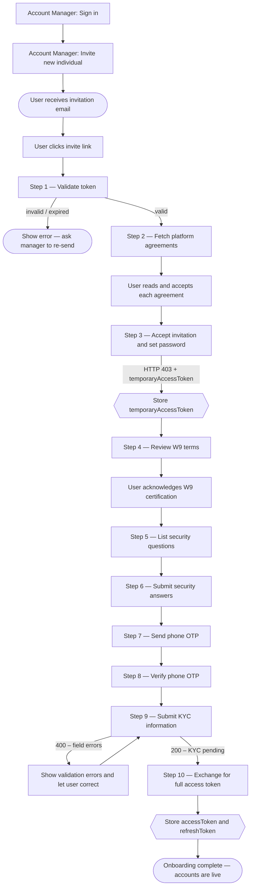

After an account manager sends an invitation, the individual user completes a guided 10-step flow to activate their accounts.

---

## Full Onboarding Journey



---

## Steps 1–10

### Step 1: Validate the invitation token

Before rendering any UI, confirm the invite link is still valid.

`GET /branches/public/v1/common/invites/check?token=<invite_token>`

- **Auth**: None
- **On success (200)**: Token is valid — proceed to step 2.
- **On error (400/404)**: Show "Invitation expired or not found."

---

### Step 2: Fetch platform agreements

`GET /branches/public/v1/common/agreements`

- **Auth**: None
- Display each agreement's title and content. Require the user to tick "I agree" for each before continuing.

---

### Step 3: Accept the invitation

`POST /branches/public/v1/individual/invites/accept`

```json
{
  "token": "<invite_token>",
  "password": "SecurePassword#2024",
  "confirmPassword": "SecurePassword#2024",
  "agreementIds": [1, 2, 3]
}
```

**On success (403 with body):**

```json
{
  "data": { "temporaryAccessToken": "eyJ..." },
  "errors": [{ "code": "required additional actions", "meta": { "fields": ["phoneNumber", "kyc"] } }]
}
```

> HTTP 403 here is intentional. Extract `data.temporaryAccessToken` and store it. Use it for steps 4–9. The `meta.fields` array tells you which steps are still required.

---

### Step 4: Show W9 terms

`GET /branches/private/v1/limited/w9/terms`

- **Auth**: Temporary token
- Display the W9 tax certification text. Record the timestamp of user acceptance for step 9.

---

### Step 5: List security questions

`GET /users/private/v1/limited/security-questions`

- **Auth**: Temporary token
- Present 3 questions for the user to choose and answer.

---

### Step 6: Submit security answers

`POST /users/private/v1/limited/security-questions/answers`

```json
{
  "answers": [
    { "questionId": 1, "answer": "Seattle" },
    { "questionId": 5, "answer": "Buddy" },
    { "questionId": 9, "answer": "Blue" }
  ]
}
```

- **Auth**: Temporary token. Exactly 3 distinct question IDs required.

---

### Step 7: Send phone OTP

`POST /users/private/v1/limited/generate-new-phone-code`

- **Auth**: Temporary token
- Triggers an SMS to the phone number registered during invitation.

---

### Step 8: Verify phone OTP

`PUT /users/private/v1/limited/check-phone-code`

```json
{ "code": "ABC12" }
```

- **Auth**: Temporary token. On success, the phone is confirmed.

---

### Step 9: Submit KYC information

`POST /branches/private/v1/limited/individual/signup`

```json
{
  "dateOfBirth": "1990-03-20",
  "socialSecurityNumber": "987-65-4321",
  "usCitizenshipStatus": "Citizen",
  "address": {
    "address": "123 Main Street",
    "city": "New York",
    "state": "NY",
    "zipCode": "10001",
    "country": "US"
  },
  "w9": {
    "isSubjectToBackupWithholding": false,
    "accepted": true,
    "timestamp": "2024-03-15T14:22:00Z"
  },
  "employment": {
    "status": "employed",
    "employer": "Acme Corp",
    "occupation": "Engineer"
  },
  "transferActivity": {
    "expectedMonthlyTransactions": 10,
    "expectedMonthlyVolume": "5000.00"
  }
}
```

- **Auth**: Temporary token
- **On success (200)**: KYC submitted, processing asynchronously.
- **On error (400)**: Check `errors` array for field-level failures.

---

### Step 10: Exchange temporary token for full access

`PUT /users/private/v1/limited/token-exchange`

- **Auth**: Temporary token

```json
{
  "data": {
    "accessToken": "eyJ...",
    "refreshToken": "LUF..."
  }
}
```

Store both tokens. Onboarding is complete and the user's accounts are immediately available.
