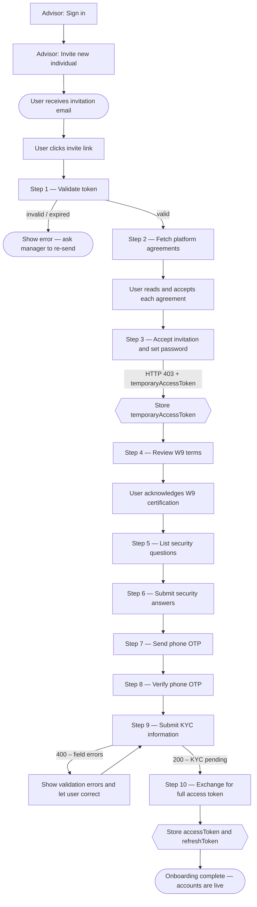

Complete guide for individual users — onboarding, accounts, balances, transfers, notifications, KYC, and account closure.

This section covers everything an Individual user can do after receiving an Advisor's invitation — from completing onboarding through daily banking operations.

---

## What can you do?

<Cards>
  <Card title="Registration" href="./registration" icon="fa-duotone fa-list-check">Complete the 10-step flow: validate invite token, accept agreements, set password, W9, security questions, phone OTP, KYC, and token exchange.</Card>
  <Card title="Accounts & Balances" href="./accounts" icon="fa-duotone fa-wallet">View total balance, list all accounts, and get per-account details including available and pending balances.</Card>
  <Card title="Transactions" href="./transactions" icon="fa-duotone fa-receipt">Full paginated transaction history with status filtering and individual transaction details.</Card>
  <Card title="Account Statements" href="./account-statements" icon="fa-duotone fa-file-invoice">Download monthly PDF statements for any account by year and month.</Card>
  <Card title="Move Money" href="./move-money" icon="fa-duotone fa-money-bill-transfer">Internal transfers between the user's own accounts (TBA) and ACH pulls/pushes to linked external bank accounts via Plaid.</Card>
  <Card title="Notifications" href="./notifications" icon="fa-duotone fa-bell">Unread count badge, full notification list, mark all as read, and mark individual notifications as read.</Card>
  <Card title="KYC" href="./kyc" icon="fa-duotone fa-shield-check">Check KYC verification status and respond to document verification requests.</Card>
  <Card title="Account Closure" href="./account-closure" icon="fa-duotone fa-circle-xmark">Handle the two-step OTP-confirmed account deletion flow.</Card>
</Cards>

---

## Full Onboarding Journey

