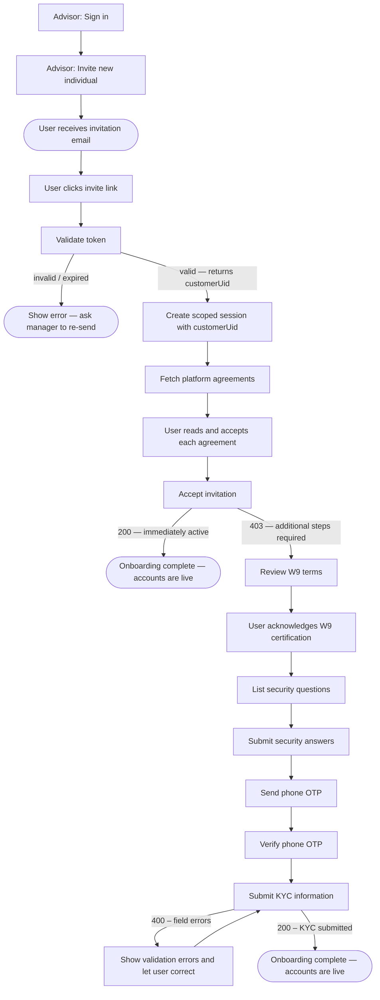

After an Advisor sends an invitation, the individual user completes a guided onboarding flow — covering invitation acceptance, agreements, W9, security questions, phone OTP, and KYC submission — to activate their accounts.

---

## Full Onboarding Journey



---

## Steps

### Step 1: Validate the invitation token

`GET /branches/public/v1/common/invites/check?token=<invite_token>`

- **Auth**: None
- **On success (200)**: Returns `role` and `customerUid` — proceed to session creation.
- **On error (400)**: Show "Invitation expired or not found."

```json
{
  "data": {
    "role": "individual",
    "customerUid": "a1b2c3d4-0000-0000-0000-000000000001"
  }
}
```

---

### Create a scoped session (before Step 3)

Use the `customerUid` from Step 1 to open a session for this user:

`POST /entrypoint/org/v1/sessions`

```json
{
  "clientId":     "<your-client-id>",
  "clientSecret": "<your-client-secret>",
  "customerUid":  "<customerUid from Step 1>"
}
```

```json
{
  "data": {
    "sessionId": "4bdfca21-461e-45a2-9d26-64f4176267c7",
    "expiresAt": "2026-06-24T12:00:00Z"
  }
}
```

Include these headers on **every request from Step 3 onward**:

```
X-Session-Id: <sessionId>
X-Client-Id:  <clientId>
```

---

### Step 2: Fetch platform agreements

`GET /branches/public/v1/common/agreements`

- **Auth**: None
- Display each agreement's title and content. Require the user to acknowledge each one before continuing.

---

### Step 3: Accept the invitation

`POST /branches/public/v1/individual/invites/accept?token=<invite_token>`

- **Auth**: Session headers
- No request body required.

| HTTP | Meaning |
|------|---------|
| `200` | Account is immediately active — onboarding complete. |
| `403` | Account created; continue with Steps 4–9. |

> **Path differs per user type:**
> - **Individual**: `/branches/public/v1/individual/invites/accept`
> - **Business Owner**: `/branches/public/v1/businessowner/invites/accept`
> - **Operator**: `/branches/public/v1/operator/invites/accept`

---

### Step 4: Review W9 terms

`GET /branches/private/v1/limited/w9/terms`

- **Auth**: Session headers
- Display the W9 tax certification text. Record the timestamp of user acceptance for Step 9.

---

### Step 5: List security questions

`GET /users/private/v1/limited/security-questions`

- **Auth**: Session headers
- Present questions for the user to choose from and answer.

---

### Step 6: Submit security answers

`POST /users/private/v1/limited/security-questions/answers`

```json
{
  "answers": [
    { "questionId": 1, "answer": "Seattle" },
    { "questionId": 5, "answer": "Buddy" },
    { "questionId": 9, "answer": "Blue" }
  ]
}
```

- **Auth**: Session headers. Exactly 3 distinct question IDs required.

---

### Step 7: Send phone OTP

`POST /users/private/v1/limited/generate-new-phone-code`

- **Auth**: Session headers
- Triggers an SMS to the phone number registered during invitation.

---

### Step 8: Verify phone OTP

`PUT /users/private/v1/limited/check-phone-code`

```json
{ "code": "ABC12" }
```

- **Auth**: Session headers. On success, the phone is confirmed.

---

### Step 9: Submit KYC information

`POST /branches/private/v1/limited/individual/signup`

```json
{
  "dateOfBirth": "03/20/1990",
  "socialSecurityNumber": "987-65-4321",
  "usCitizenshipStatus": "Citizen",
  "address": {
    "address": "123 Main Street",
    "city": "New York",
    "state": "NY",
    "zipCode": "10001",
    "country": "USA"
  },
  "w9": {
    "isSubjectToBackupWithholding": false,
    "accepted": true,
    "timestamp": "2024-03-15T14:22:00Z"
  },
  "employment": {
    "status": "employed",
    "employer": "Acme Corp",
    "occupation": "Engineer"
  },
  "transferActivity": {
    "expectedMonthlyTransactions": 10,
    "expectedMonthlyVolume": "5000.00"
  }
}
```

- **Auth**: Session headers
- **On success (200)**: KYC submitted — onboarding complete. Accounts are live.
- **On error (400)**: Check `errors` array for field-level failures, correct and resubmit.

> **Path differs per user type:**
> - **Individual** (KYC): `/branches/private/v1/limited/individual/signup`
> - **Business Owner** (KYB): `/branches/private/v1/limited/businessowner/signup`
> - **Operator** (KYC): `/branches/private/v1/limited/operator/signup`
