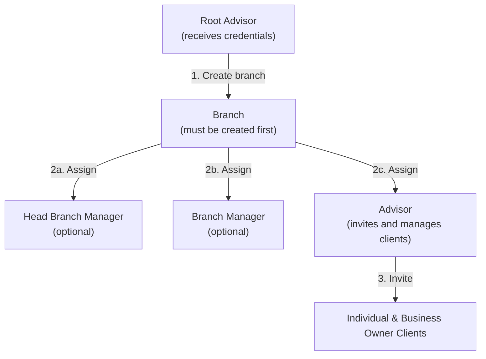
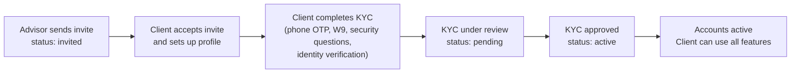
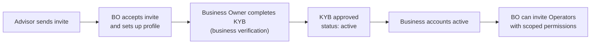

Getting started with TAPP Cash involves four phases: requesting credentials, building your admin hierarchy, inviting clients, and monitoring their onboarding journey.

---

## Step 1 — Request Credentials

Organization credentials are provisioned by the TAPP Cash team — they are not self-service.

Email `support@tappcash.com` with the following details:

| Field         | Description                                       |
|---------------|---------------------------------------------------|
| Organization  | Your company or institution name                  |
| Contact name  | Full name of the primary technical contact        |
| Environment   | Staging or Production                             |
| Use case      | Brief description of what you are integrating     |

The team will review your request, provision your organization, and issue your **Root Advisor** credentials (`clientId` and `clientSecret`). See [Authentication](/docs/authentication) for how to use these credentials to create a session.

> Credentials are environment-specific — staging credentials will not work against the production base URL.

---

## Step 2 — Set Up Your Admin Hierarchy

Once credentials are provisioned, the Root Advisor builds the organization structure before any clients can be invited. **Every admin role and every client belongs to a Branch — creating a Branch is always the first action.**

### Hierarchy Overview



### 2a — Create a Branch

`POST /branches/private/v1/branch`

A Branch is the container that groups admin users and client portfolios. **All advisors, branch managers, and clients are assigned to a branch.** Create at least one branch before creating any other admin roles.

```json
{
  "name": "Main Branch"
}
```

### 2b — Create Admin Roles for the Branch

With a branch in place, the Root Advisor creates the admin roles that will manage it. All role creation endpoints accept a `branchId` to assign the new admin to their branch.

| Role | Endpoint | Purpose |
|------|----------|---------|
| Head Branch Manager | `POST /branches/private/v1/superadvisor` | Oversees an entire branch; can manage Branch Managers and Advisors |
| Branch Manager | `POST /branches/private/v1/branchmanager` | Day-to-day branch operations |
| Advisor | `POST /branches/private/v1/advisor` | Front-line role that directly invites and manages clients |

> Detailed request bodies and setup steps for each role are covered in the [Administration Guide](/docs/administration).

Once an Advisor's account is approved and active, they can begin inviting clients.

---

## Step 3 — Invite Clients

Advisors invite two types of clients: **Individual** users and **Business Owner** users. Both follow an invitation-based flow — the Advisor triggers the invite, the client receives an email, and completes their own onboarding independently.

### Invite an Individual

`POST /branches/private/v1/individual`

- **Auth**: Advisor session

```json
{
  "firstName": "Jane",
  "lastName": "Doe",
  "email": "jane.doe@example.com",
  "phoneNumber": "+12025550191"
}
```

On success the individual record is created with `status: "invited"` and an invitation email is dispatched automatically.

### Invite a Business Owner

`POST /branches/private/v1/businessowner`

- **Auth**: Advisor session

Same pattern as Individual. The Business Owner receives an email, accepts the invite, completes KYB verification, and their business accounts become active. They can then invite Operators to manage accounts on their behalf.

---

## Step 4 — Client Onboarding Journey

After the Advisor sends the invitation, the client completes their onboarding steps independently. The Advisor can monitor progress via the client list endpoint.

### Individual Client Flow



Once KYC is approved and `status` becomes `active`, the client can:

- Move money (TBA and ACH transfers)
- View account statements
- Manage external accounts
- Receive and manage notifications
- Set up auto-payments
- Request account closure

### Business Owner Client Flow



After KYB approval, the Business Owner can invite **Operators** — team members granted scoped permissions (`transferFunds`, `autoPay`) to act on the business accounts.

---

## Step 5 — Monitor Clients

Use the admin endpoints to list and track client status across your portfolio.

### List Individual Clients

`GET /branches/private/v1/individual`

```
GET /branches/private/v1/individual?page[number]=1&page[size]=20
X-Session-Id: <sessionId>
X-Client-Id:  <clientId>
```

**Response (abbreviated):**

```json
{
  "data": [
    {
      "id": "cba69452-3767-47cc-9b54-1d82a3549741",
      "firstName": "Jane",
      "lastName": "Doe",
      "email": "jane.doe@example.com",
      "status": "active"
    }
  ],
  "meta": {
    "totalRecord": 127,
    "totalPage": 7,
    "pageNumber": 1,
    "limit": 20
  }
}
```

`GET /branches/private/v1/individual/{id}` returns the full profile for a single client, including KYC status and assigned Advisor.

### List Business Owner Clients

`GET /branches/private/v1/businessowner`

Same pagination and filter pattern as individual clients.

---

## Common Errors

| Status | Cause | Fix |
|--------|-------|-----|
| `401` | Missing or expired session | Create a new session via `POST /entrypoint/org/v1/sessions` |
| `403` | Valid session but insufficient role | Ensure the credential has the required permission for this endpoint |
| `404` | Branch or client not found | Verify the `branchId` or client `id` in the request |
