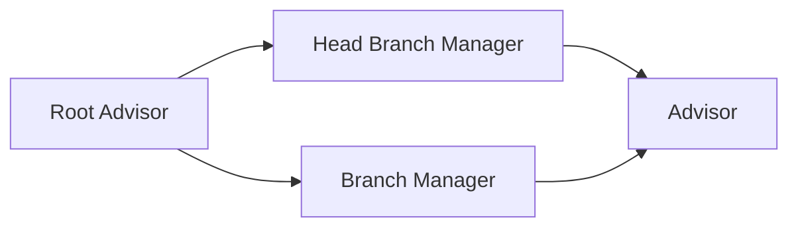

Getting started with TappCash involves three phases: requesting credentials for your organization, signing in and configuring your environment, and then setting up your admin hierarchy to begin inviting clients.

---

## Step 1 — Request Credentials

Organization credentials are provisioned by the TappCash team — they are not self-service.

Email **[support@tappcash.com](mailto:support@tappcash.com)** with the following details:

| Field         | Description                                       |
|---------------|---------------------------------------------------|
| Organization  | Your company or institution name                  |
| Contact name  | Full name of the primary technical contact        |
| Environment   | Staging or Production                             |
| Use case      | Brief description of what you are integrating     |

The team will review your request, create your Root Advisor account, and reply with your `login` (email) and a temporary password.

> Credentials are environment-specific — staging credentials will not work against the production base URL.

---

## Step 2 — Sign In

`POST /users/public/v1/auth/signin`

```json
{
  "login": "admin@yourorg.com",
  "password": "TemporaryPassword123!"
}
```

**Response:**

```json
{
  "data": {
    "accessToken": "eyJ...",
    "refreshToken": "LUF..."
  }
}
```

Store both tokens. The `accessToken` expires after **30 minutes**. The `refreshToken` is valid for **30 days**.

On first sign-in you will be prompted to change your temporary password via `POST /users/private/v1/auth/change_password`.

---

## Step 3 — Refresh an Expired Token

`POST /users/public/v1/auth/refresh`

Pass the `refreshToken` in the request body to obtain a new `accessToken` without re-login. Call this automatically whenever you receive a `401` on a private endpoint.

```json
{
  "refreshToken": "LUF..."
}
```

---

## Step 4 — Set Up Your Admin Hierarchy

Once signed in as Root Advisor, build out your organization's admin structure before inviting clients. The hierarchy flows downward:



Each **Advisor** is the front-line role that directly invites and manages client users. Depending on your organization's size, you may operate with a single Advisor or a full hierarchy of Head Branch Managers, Branch Managers, and Advisors.

> Detailed steps for creating and managing each admin tier are covered in the Admin Roles guide.

---

## Step 5 — Invite Your First Client

Advisors can invite two types of clients: **Individual** users and **Business Owner** users. Both follow an invitation-based flow — the client receives an email and completes their own onboarding steps.

**Invite an Individual**

`POST /branches/private/v1/individual`

- **Auth**: Advisor access token

```json
{
  "firstName": "Jane",
  "lastName": "Doe",
  "email": "jane.doe@example.com",
  "phoneNumber": "+12025550191"
}
```

On success, the individual record is created with `status: "invited"` and an invitation email is dispatched automatically. The user then follows the [Individual Account](./individual-account) onboarding steps.

**Invite a Business Owner**

Business Owner invitations follow the same pattern. The Business Owner receives an email, accepts the invite, completes KYB verification, and their business accounts become active. They can then invite Operators to manage their accounts on their behalf.

> See the Business Owner guide for the full KYB and Operator management flow.

---

## Step 6 — List and Monitor Clients

`GET /branches/private/v1/individual`

- **Auth**: Advisor access token
- Returns a paginated list of all Individual clients under this Advisor's branch.

```
GET /branches/private/v1/individual?page[number]=1&page[size]=20
Authorization: Bearer <advisor_token>
```

**Response (abbreviated):**

```json
{
  "data": [
    {
      "id": "cba69452-3767-47cc-9b54-1d82a3549741",
      "firstName": "Jane",
      "lastName": "Doe",
      "email": "jane.doe@example.com",
      "status": "active"
    }
  ],
  "meta": {
    "totalRecord": 127,
    "totalPage": 7,
    "pageNumber": 1,
    "limit": 20
  }
}
```

`GET /branches/private/v1/individual/{id}` returns the full profile for a single individual. Use the `id` returned by the list endpoint.

---

## Authentication Errors

| Status | Cause                            | Fix                                                                     |
|--------|----------------------------------|-------------------------------------------------------------------------|
| `401`  | Missing or expired `accessToken` | Call `POST /users/public/v1/auth/refresh` with your `refreshToken`      |
| `401`  | Invalid credentials              | Verify `login` and `password`; contact support if locked out            |
| `403`  | Valid token but wrong role       | Ensure you are using the correct token for the endpoint's required role |
