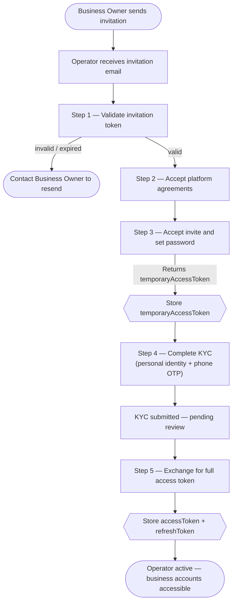

Operators are team members invited by a Business Owner to manage their business accounts. Each Operator acts on behalf of the Business Owner within the boundaries of the permissions they have been granted. Operators complete KYC verification before gaining access.

---

## What Operators can do

An Operator's capabilities depend entirely on the permissions assigned by the Business Owner.

<Cards>
  <Card title="View Accounts & Balances" href="../business-owner/accounts" icon="fa-duotone fa-wallet">View the business's accounts and balances. Account viewing is available to all active Operators regardless of permissions.</Card>
  <Card title="Transfer Funds" href="../business-owner/move-money" icon="fa-duotone fa-arrow-right-arrow-left">Initiate TBA internal transfers and ACH external transfers — requires the `transferFunds` permission.</Card>
  <Card title="Auto-Payments" href="../business-owner/move-money" icon="fa-duotone fa-clock-rotate-left">Create and manage recurring scheduled payments — requires the `autoPay` permission.</Card>
</Cards>

---

## Operator Onboarding

Operators are invited by a Business Owner and follow an invitation-based onboarding flow. The flow is similar to Individual onboarding, but the Operator completes **KYC** (personal identity verification) rather than KYB.



The onboarding steps (validate token → accept agreements → set password → KYC → token exchange) follow the same API calls as Individual registration. See [Individual Registration](../individual-account/registration) for the full step-by-step API reference.

---

## Permissions

The Business Owner assigns permissions when creating the Operator invitation. These can be updated at any time.

| Permission      | What it allows                                               |
|-----------------|--------------------------------------------------------------|
| `transferFunds` | Initiate TBA internal transfers and ACH external transfers   |
| `autoPay`       | Create, update, and delete auto-payment schedules            |

When an Operator attempts an action they are not permitted for, the API returns `403 Forbidden`.

---

## Authentication

Operators authenticate using the same sign-in endpoint as all other users:

`POST /users/public/v1/auth/signin`

```json
{
  "login": "operator@business.com",
  "password": "Password123!"
}
```

The returned `accessToken` is scoped to the Operator role. All requests using this token are automatically limited to the Business Owner's accounts and the Operator's assigned permissions.

---

## Scope of Access

Operators can only access the business accounts of the Business Owner who invited them. An Operator token cannot access:

- Any accounts belonging to other Business Owners
- Admin endpoints (advisor, branch, or platform management)
- Individual user accounts
- Business Owner management features (inviting other Operators)

---

## Token Expiry

| Token          | Lifetime   | Renewal                                                        |
|----------------|------------|----------------------------------------------------------------|
| `accessToken`  | 30 minutes | Call `POST /users/public/v1/auth/refresh` with `refreshToken`  |
| `refreshToken` | 30 days    | Sign in again after expiry                                     |
