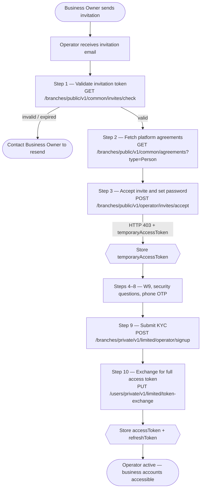

Operators are team members invited by a Business Owner to manage business accounts on their behalf — each completes KYC verification and acts within the boundaries of the permissions granted to them.

---

## What Operators can do

<Cards>
  <Card title="Registration" href="/docs/operator-registration" icon="fa-duotone fa-list-check">Complete the KYC onboarding flow — validate invite token, set password, verify phone, submit identity, and exchange for a full access token.</Card>
  <Card title="Accounts & Balances" href="/docs/operator-accounts" icon="fa-duotone fa-wallet">View the Business Owner's accounts, account details, bank details, and total balance across all accounts.</Card>
  <Card title="Move Money" href="/docs/operator-move-money" icon="fa-duotone fa-money-bill-transfer">Initiate internal TBA transfers and ACH external transfers — requires `transferFunds` or `transferACH` permission.</Card>
  <Card title="Auto-Payments" href="/docs/operator-auto-payments" icon="fa-duotone fa-clock-rotate-left">Set up and manage recurring scheduled payments — requires the `autoPay` permission.</Card>
  <Card title="Transactions" href="/docs/operator-transactions" icon="fa-duotone fa-receipt">View the full transaction history for the Business Owner's accounts.</Card>
</Cards>

---

## Onboarding Journey

Operators follow an invitation-based onboarding flow identical to Individual users — with KYC (personal identity verification) instead of KYB.



See [Registration](/docs/operator-registration) for the full step-by-step guide.

---

## Permissions

The Business Owner assigns permissions when creating the Operator invitation and can update them at any time.

| Permission | What it enables |
|------------|-----------------|
| `transferFunds` | Initiate TBA (internal) and TBU (user-to-user) transfers |
| `transferACH` | Initiate ACH external transfers via linked bank accounts |
| `autoPay` | Create, view, and cancel recurring auto-payments |

Attempting an action without the required permission returns `403 Forbidden`. Always check the Operator's current permissions before rendering transfer UI.

**Get current permissions:**

`GET /branches/private/v1/limited/operator/details`

- **Auth**: Operator access token

Returns the Operator profile including the current `permissions` object. Call this on sign-in to determine which features to show in your UI.

---

## Authentication

**Sign in:**

`POST /users/public/v1/auth/signin`

```json
{
  "email": "operator@business.com",
  "password": "Password123!",
  "roles": ["businessoperator"]
}
```

**Refresh token:**

`POST /users/public/v1/auth/refresh`

```json
{
  "refreshToken": "<refresh_token>"
}
```

| Token | Lifetime | Renewal |
|-------|----------|---------|
| `accessToken` | 30 minutes | Call `POST /users/public/v1/auth/refresh` |
| `refreshToken` | 30 days | Sign in again after expiry |

---

## Scope of Access

Operators can only access the accounts of the Business Owner who invited them. An Operator token cannot access:

- Accounts belonging to any other Business Owner
- Admin endpoints (branch, advisor, or platform management)
- Individual user accounts
- Business Owner management features (inviting or managing other Operators)
