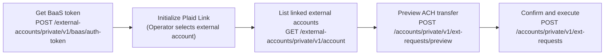

Operators can initiate TBA internal transfers and ACH external transfers on behalf of the Business Owner — all transfer operations check permissions before executing and return `403 Forbidden` if the required permission is missing.

---

## Permission Requirements

| Transfer type | Required permission |
|---------------|---------------------|
| Internal (TBA) | `transferFunds` |
| ACH external | `transferACH` |

Check the Operator's current permissions before rendering transfer UI:

`GET /branches/private/v1/limited/operator/details`

```json
{
  "data": {
    "permissions": {
      "transferFunds": true,
      "transferACH": false,
      "autoPay": true
    }
  }
}
```

---

## Internal Transfer — TBA (Transfer Between Accounts)

TBA moves funds between two of the Business Owner's accounts within TAPP Cash. Always preview before executing — preview calculates the fee and confirms available balance.

### Preview

`POST /accounts/private/v1/tba-requests/preview`

- **Auth**: Operator access token
- **Requires**: `transferFunds` permission

```json
{
  "accountIdFrom": 1,
  "accountIdTo": 2,
  "outgoingAmount": "500.00"
}
```

**Response:**

```json
{
  "data": {
    "outgoingAmount": "500.00",
    "fee": "2.50",
    "incomingAmount": "497.50"
  }
}
```

Show the fee breakdown to the user before they confirm.

### Execute

`POST /accounts/private/v1/tba-requests`

- **Auth**: Operator access token
- **Requires**: `transferFunds` permission

```json
{
  "accountIdFrom": 1,
  "accountIdTo": 2,
  "outgoingAmount": "500.00",
  "incomingAmount": "497.50",
  "description": "Office supplies reimbursement"
}
```

| Field | Type | Required | Notes |
|-------|------|:--------:|-------|
| `accountIdFrom` | integer | ✓ | Source account ID |
| `accountIdTo` | integer | ✓ | Destination account ID — must differ from source |
| `outgoingAmount` | string (decimal) | ✓ | Must be > 0 |
| `incomingAmount` | string (decimal) | ✓ | From the preview response |
| `description` | string | | Up to 255 characters |

> If Branch Manager approval is required for this branch, the transfer enters `pending_approval` status. An admin must approve it before funds move.

---

## ACH Transfer (External Bank Account)

ACH moves funds between a TAPP Cash account and an external bank account linked via Plaid.



### Step 1 — Get BaaS Token

`POST /external-accounts/private/v1/baas/auth-token`

- **Auth**: Operator access token
- **Requires**: `transferACH` permission

Returns a BaaS token used to initialize the Plaid Link session. Display the Plaid Link UI to let the Operator select or connect an external bank account.

### Step 2 — List External Accounts

`GET /external-accounts/private/v1/account`

- **Auth**: Operator access token

Returns all external bank accounts the Business Owner has linked via Plaid.

**Response fields per account:**

| Field | Description |
|-------|-------------|
| `id` | External account identifier — use as `toAccountId` or `fromAccountId` in transfer |
| `accountNumber` | Last 4 digits of the bank account |
| `routingNumber` | Bank routing number |
| `accountOwnerName` | Name on the bank account |
| `bankName` | Name of the external bank |

### Step 3 — Preview ACH Transfer

`POST /accounts/private/v1/ext-requests/preview`

- **Auth**: Operator access token
- **Requires**: `transferACH` permission

```json
{
  "fromAccountId": "42",
  "toAccountId": "<external_account_id>",
  "amount": "1000.00"
}
```

Either `fromAccountId` or `toAccountId` can be the external account — pull money in or push money out.

**Response:**

```json
{
  "data": {
    "amount": "1000.00",
    "fee": "5.00",
    "totalDeducted": "1005.00"
  }
}
```

### Step 4 — Execute ACH Transfer

`POST /accounts/private/v1/ext-requests`

- **Auth**: Operator access token
- **Requires**: `transferACH` permission

```json
{
  "fromAccountId": "42",
  "toAccountId": "<external_account_id>",
  "amount": "1000.00",
  "description": "Vendor payment"
}
```

ACH transfers are processed asynchronously. Track status by polling `GET /accounts/private/v1/transactions`.

---

## Transfer Limits

ACH transfers are subject to limits configured by the platform. The preview response indicates if a transfer would exceed the limit — validate against the preview before presenting a confirmation screen.
