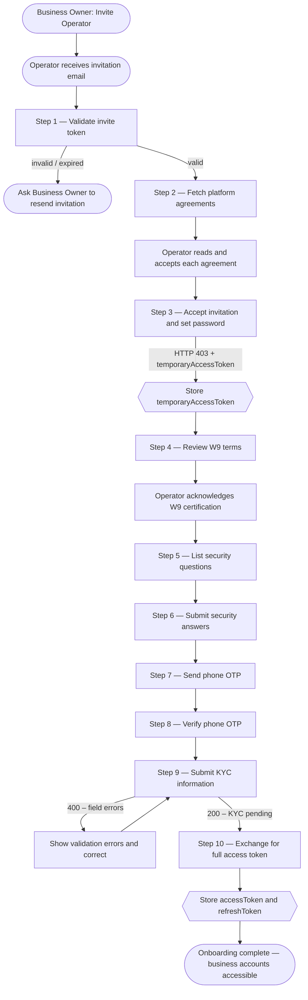

Step-by-step KYC onboarding flow for Operators — from invitation email through full account activation.

Operators are invited by a Business Owner and must complete a 10-step KYC onboarding flow before gaining access to business accounts. The steps are identical to Individual onboarding, with the only differences being the invite acceptance endpoint and the KYC signup endpoint.

---

## Full Onboarding Flow



---

## Step 1 — Validate Invite Token

`GET /branches/public/v1/common/invites/check`

- **Auth**: None
- **When**: User clicks the link in the invitation email

```
GET /branches/public/v1/common/invites/check?token=<invite_token>
```

**Response:**

```json
{
  "data": {
    "role": "businessoperator",
    "phoneNumber": "+12025550106"
  }
}
```

If this returns `400`, the token is expired or already used. The Business Owner must send a new invitation.

---

## Step 2 — Fetch Platform Agreements

`GET /branches/public/v1/common/agreements`

- **Auth**: None

```
GET /branches/public/v1/common/agreements?type=Person
```

Display each agreement to the Operator and require confirmation before proceeding.

---

## Step 3 — Accept Invite and Set Password

`POST /branches/public/v1/operator/invites/accept`

- **Auth**: None
- **Returns**: HTTP `403` on success (intentional — not an error)

```json
{
  "token": "<invite_token>",
  "password": "NewSecurePassword123!"
}
```

**Response (HTTP 403):**

```json
{
  "data": {
    "temporaryAccessToken": "<temp_token>"
  },
  "meta": {
    "fields": ["phoneNumber", "kyc"]
  }
}
```

Extract and store the `temporaryAccessToken` — it is required for steps 4–9. The `meta.fields` array lists remaining required steps:
- `"phoneNumber"` — phone OTP steps (7–8) must be completed
- `"kyc"` — KYC submission (step 9) must be completed

---

## Steps 4–8 — W9, Security Questions, Phone OTP

Use the `temporaryAccessToken` as `Authorization: Bearer <temp_token>` for all steps below.

**Step 4 — Get W9 terms:**

`GET /branches/private/v1/limited/w9/terms`

**Step 5 — List security questions:**

`GET /users/private/v1/limited/security-questions`

**Step 6 — Submit security answers:**

`POST /users/private/v1/limited/security-questions/answers`

```json
{
  "answers": [
    { "questionId": "<id>", "answer": "my answer" }
  ]
}
```

**Step 7 — Send phone OTP:**

`POST /users/private/v1/limited/generate-new-phone-code`

Sends a one-time code to the Operator's registered phone number.

**Step 8 — Verify phone OTP:**

`PUT /users/private/v1/limited/check-phone-code`

```json
{
  "code": "123456"
}
```

---

## Step 9 — Submit KYC Information

`POST /branches/private/v1/limited/operator/signup`

- **Auth**: Temporary access token

```json
{
  "firstName": "Alex",
  "lastName": "Johnson",
  "middleName": "R",
  "dateOfBirth": "05/10/1992",
  "socialSecurityNumber": "123-45-6789",
  "citizenship": "Citizen",
  "address": {
    "address": "789 Team St",
    "city": "Austin",
    "state": "TX",
    "zipCode": "78703",
    "country": "US"
  },
  "employment": {
    "isCurrentlyEmployed": true,
    "occupation": "Operations Manager",
    "employer": "Acme Corp",
    "annualIncome": "60000.00",
    "employmentStartDate": "01/15/2020",
    "incomeSources": [
      { "name": "Salary", "amount": "60000.00", "frequency": "Annually" }
    ]
  },
  "w9": {
    "isSubjectToBackupWithholding": false,
    "accepted": true,
    "timestamp": "2024-01-15T10:30:00Z"
  }
}
```

| Field | Type | Required | Notes |
|-------|------|:--------:|-------|
| `firstName` / `lastName` | string | ✓ | |
| `middleName` | string | | |
| `dateOfBirth` | string | ✓ | `MM/DD/YYYY` |
| `socialSecurityNumber` | string | ✓ | SSN |
| `citizenship` | string | ✓ | `Citizen`, `PermanentResident`, or `NonResident` |
| `address` | object | ✓ | Street, city, state, ZIP, country |
| `employment` | object | ✓ | Current employment status and income |
| `w9.accepted` | boolean | ✓ | Must be `true` to proceed |

KYC review is asynchronous. After token exchange (step 10), poll `GET /kyc/private/v1/requests/last` to check status.

---

## Step 10 — Exchange for Full Access Token

`PUT /users/private/v1/limited/token-exchange`

- **Auth**: Temporary access token

```
PUT /users/private/v1/limited/token-exchange
Authorization: Bearer <temporaryAccessToken>
V-Client-Device-Id: <device-uuid>
```

**Response:**

```json
{
  "data": {
    "accessToken": "<full_access_token>",
    "refreshToken": "<refresh_token>"
  }
}
```

Store both tokens. Use `accessToken` for all subsequent requests (30-minute lifetime). Use `refreshToken` to renew it without re-login (30-day lifetime).

---

## KYC Status

`GET /kyc/private/v1/requests/last`

- **Auth**: Operator access token (full)

After token exchange, poll this endpoint to monitor KYC verification:

| Status | Meaning |
|--------|---------|
| `pending` | KYC submitted and under review |
| `approved` | Identity verified — full access active |
| `rejected` | KYC failed — check `errors` for rejection reasons |

> The Business Owner is notified when KYC is approved or rejected.
