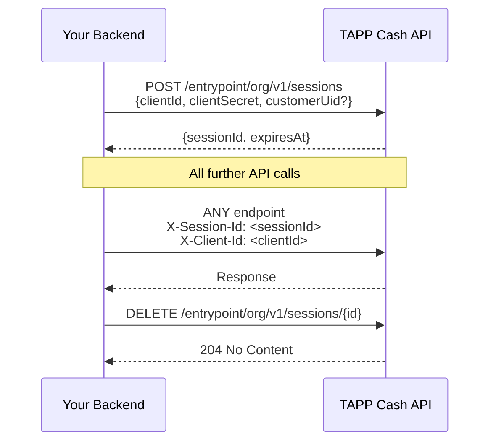

The **Org API** is for organizations that want to call TAPP Cash from their own backend — automated jobs, backend services, and server-to-server integrations. It uses **API key authentication** (ClientId + ClientSecret) instead of the email-and-password flow used by the UI.

> **This is not the UI auth flow.** The email + password sign-in is for human users accessing the admin or client portal. The Org API is for machines.

---

## How It Works



---

## Step 1 — Get Credentials

Contact `support@tappcash.com` to get API access enabled for your organization and receive your credentials. You will receive:

| Value | Format | Example |
|-------|--------|---------|
| `clientId` | `ci_test_…` (sandbox) or `ci_live_…` (production) | `ci_test_3f7a9c2e-…` |
| `clientSecret` | `cs_test_…` (sandbox) or `cs_live_…` (production) | `cs_test_AbCdEf…` |

> **The `clientSecret` is shown only once.** Copy it immediately and store it in your secrets manager (e.g. AWS Secrets Manager, HashiCorp Vault, `.env`). It cannot be retrieved again — only a new credential can be issued.

---

## Step 2 — Create a Session

Call `POST /entrypoint/org/v1/sessions` with your credentials in the request body:

```json
{
  "clientId": "ci_test_3f7a9c2e-1234-5678-abcd-ef0123456789",
  "clientSecret": "cs_test_AbCdEf123..."
}
```

**Response:**

```json
{
  "data": {
    "sessionId": "550e8400-e29b-41d4-a716-446655440000",
    "expiresAt": "2026-06-22T10:00:00Z"
  }
}
```

Sessions are valid for **24 hours**. Store the `sessionId` and reuse it across requests until it expires or you revoke it.

---

## Step 3 — Call Any Endpoint

Include two headers on every authenticated request:

```
X-Session-Id: 550e8400-e29b-41d4-a716-446655440000
X-Client-Id:  ci_test_3f7a9c2e-1234-5678-abcd-ef0123456789
```

The gateway validates that the `sessionId` was created by the supplied `clientId`. **You cannot use Client A's session with Client B's `clientId`.**

---

## Step 4 — Revoke When Done

Call `DELETE /entrypoint/org/v1/sessions/{id}` to immediately invalidate a session (e.g. on user logout or end of job):

```
DELETE /entrypoint/org/v1/sessions/550e8400-e29b-41d4-a716-446655440000
X-Session-Id: 550e8400-e29b-41d4-a716-446655440000
X-Client-Id:  ci_test_3f7a9c2e-1234-5678-abcd-ef0123456789
```

Sessions that are not explicitly revoked expire automatically after 24 hours.

---

## Acting on Behalf of a User

By default, a session is a **System** session — your backend acting autonomously. To perform an action on behalf of a specific customer (e.g. initiate a transfer for user X), pass `customerUid` when creating the session:

```json
{
  "clientId": "ci_test_3f7a9c2e-…",
  "clientSecret": "cs_test_AbCdEf…",
  "customerUid": "usr_7f3a9b12-0000-0000-0000-000000000000"
}
```

| `customerUid` | `deviceSessionType` | Meaning |
|---------------|---------------------|---------|
| Omitted | `System` | Automated backend operation |
| Provided | `User` | Acting on behalf of a specific customer |

This distinction is recorded in audit logs for every request made with that session.

---

## Environments

Credentials are environment-specific — a sandbox `clientId` cannot be used against production and vice versa.

| ClientId prefix | ClientSecret prefix | Environment |
|-----------------|---------------------|-------------|
| `ci_test_` | `cs_test_` | Sandbox — safe for testing, no real money |
| `ci_live_` | `cs_live_` | Production — real data and transactions |

To access production, contact `support@tappcash.com` to enable production credentials for your organization.

---

## IP Whitelisting

Your credentials can be locked to specific IP addresses. If configured, requests from any other IP are rejected with `403 Forbidden`. Contact `support@tappcash.com` to update the IP whitelist on your credential.

---

## Session Errors

| Status | Meaning | Fix |
|--------|---------|-----|
| `401` | Invalid `clientId` or `clientSecret` | Check credentials — secret is case-sensitive |
| `403` | API access not enabled for your org | Contact `support@tappcash.com` |
| `403` | IP not whitelisted | Contact `support@tappcash.com` to update your IP whitelist |
| `403` | Credential revoked | A new credential must be issued |
| `401` | Session expired or not found | Create a new session |
| `401` | `clientId` / `sessionId` mismatch | Ensure both headers match the same credential |

---

## Security Best Practices

- Store `clientSecret` in a secrets manager — never in source code or version control.
- Use IP whitelisting for production credentials to limit blast radius if a secret leaks.
- Use short-lived sessions: create a session per job or per user action rather than a single long-lived session shared across all operations.
- Revoke sessions explicitly when they are no longer needed.
- Use sandbox credentials (`ci_test_`) for all development and testing.
