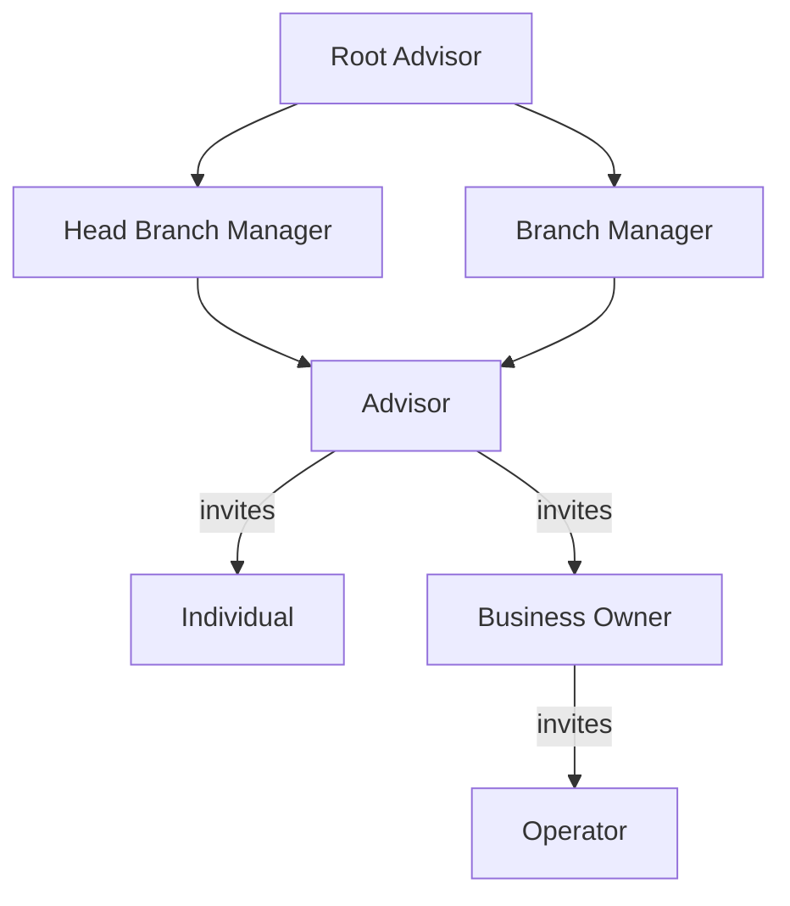

TAPP Cash is a financial platform API that gives organizations programmatic control over the full banking lifecycle — covering role hierarchy, user types, environments, and key concepts from admin setup through client operations.

---

## Role Hierarchy

TAPP Cash organizes users into two groups: **admin roles** that manage the organization and its clients, and **client-facing roles** that hold and operate financial accounts.



---

## Admin Roles

<Cards>
  <Card title="Root Advisor" href="/docs/root-advisor" icon="fa-duotone fa-crown">Top-level admin. Manages all branches and admin tiers with full visibility across every client portfolio and report.</Card>
  <Card title="Head Branch Manager" href="/docs/head-branch-manager" icon="fa-duotone fa-user-shield">Manages Advisors across branches. Oversees all client transfers, auto-payments, and reports for managed branches.</Card>
  <Card title="Branch Manager" href="/docs/branch-manager" icon="fa-duotone fa-user-gear">Manages Advisors within a branch, reviews client transfer requests and portfolios, and configures approval settings.</Card>
  <Card title="Advisor" href="/docs/advisor" icon="fa-duotone fa-user-tie">Front-line role. Invites and manages Individual and Business Owner clients — transfers, auto-payments, and reports.</Card>
</Cards>

---

## Client-Facing Roles

<Cards>
  <Card title="Individual" href="/docs/individual-user" icon="fa-duotone fa-user">Holds personal checking and savings accounts. Completes KYC, initiates transfers and ACH, and views transaction history.</Card>
  <Card title="Business Owner" href="/docs/business-owner" icon="fa-duotone fa-building">Holds business accounts. Completes KYB verification and invites Operators to manage accounts on their behalf.</Card>
  <Card title="Operator" href="/docs/operator" icon="fa-duotone fa-user-lock">Acts on behalf of a Business Owner with assigned permissions — transfer funds, run ACH, or schedule auto-payments.</Card>
</Cards>

---

## User Lifecycle


---

## Base URLs

| Environment | Base URL                                                    |
|-------------|-------------------------------------------------------------|
| Staging     | `https://api-{tenant}.stage2.tappbank.com`                  |
| Production  | `https://api-{tenant}.tappcash.com`                         |

Replace `{tenant}` with your organization's assigned tenant identifier. For example, if your tenant is `acme`:

```
POST https://api-acme.stage2.tappbank.com/users/public/v1/auth/signin
```

Contact `support@tappcash.com` to obtain your tenant identifier and production credentials.

> **Staging shortcut:** The shared test environment is available at `https://api-test.stage2.tappbank.com` — useful for initial exploration before your tenant is provisioned.

---

## Selecting Your Tenant in the API Reference

When using the **Try It** feature in the API Reference pages, a server selector appears at the top of each endpoint. You must choose the correct server and enter your tenant identifier before sending requests.

1. Open any API Reference endpoint (e.g., Sign In).
2. Click the **Server** dropdown — it defaults to the shared staging URL.
3. Select **Staging (custom tenant)** or **Production** if your organization has a dedicated tenant.
4. Replace the `{tenant}` variable in the URL field with your tenant identifier (e.g., `acme`).
5. Add your Bearer token in the **Authorization** section.
6. Click **Try It** to send the request.

If you are just getting started and do not yet have a tenant, use the default staging server (`https://api-test.stage2.tappbank.com`) with the test credentials provided during onboarding.

---

## API Versioning

Endpoints follow a versioned path pattern:

```
/{service}/{visibility}/v{version}/{resource}
```

| Segment      | Example                         | Meaning                                           |
|--------------|---------------------------------|---------------------------------------------------|
| `service`    | `users`, `branches`, `accounts` | Microservice owning the resource                  |
| `visibility` | `public`, `private`             | Public = no auth; Private = Bearer token required |
| `version`    | `v1`                            | API version                                       |
| `resource`   | `auth/signin`, `individual`     | Resource path                                     |

---

## Environments

**Staging** is for development and testing. Use test credentials and dummy data — no real money moves. Staging credentials will not work against the production base URL.

**Production** requires separate credentials issued by the TAPP Cash platform team. Contact `support@tappcash.com` to request production access.
