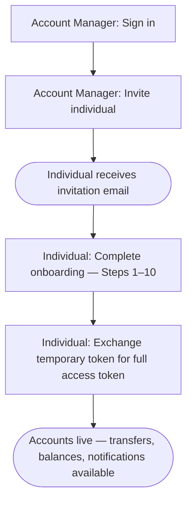

TAPP Cash is a multi-tenant financial platform. Every integration involves two distinct roles working together: an *
*Account Manager** who administers a portfolio of individuals, and **Individual Users** who hold accounts and move
money.

---

## User Roles

| Role | What they do |
|------|--------------|
| **Account Manager** *(also called Root Advisor)* | Signs in, manages a branch portfolio, sends invitations, monitors onboarding status |
| **Individual User** *(also called Individual)* | Holds financial accounts, completes onboarding, initiates transfers, views transactions |

Your API credentials are scoped to one role. Calling an endpoint outside your role returns `403 Forbidden`.

---

## The User Lifecycle



---

## Base URLs

| Environment | Base URL                                                    |
|-------------|-------------------------------------------------------------|
| Staging     | `https://api-test.stage2.tappbank.com`                      |
| Production  | Contact [support@tappcash.com](mailto:support@tappcash.com) |

All API paths are appended to the base URL. Example:

```
POST https://api-test.stage2.tappbank.com/users/public/v1/auth/signin
```

---

## API Versioning

Endpoints follow a versioned path pattern:

```
/{service}/{visibility}/v{version}/{resource}
```

| Segment      | Example                         | Meaning                                           |
|--------------|---------------------------------|---------------------------------------------------|
| `service`    | `users`, `branches`, `accounts` | Microservice owning the resource                  |
| `visibility` | `public`, `private`             | Public = no auth; Private = Bearer token required |
| `version`    | `v1`                            | API version                                       |
| `resource`   | `auth/signin`, `individual`     | Resource path                                     |

---

## Environments

**Staging** is for development and testing. Use test credentials and dummy data — no real money moves. Staging
credentials will not work against the production base URL.

**Production** requires separate credentials issued by the TAPP Cash platform team.
Contact [support@tappcash.com](mailto:support@tappcash.com) to request production access.
