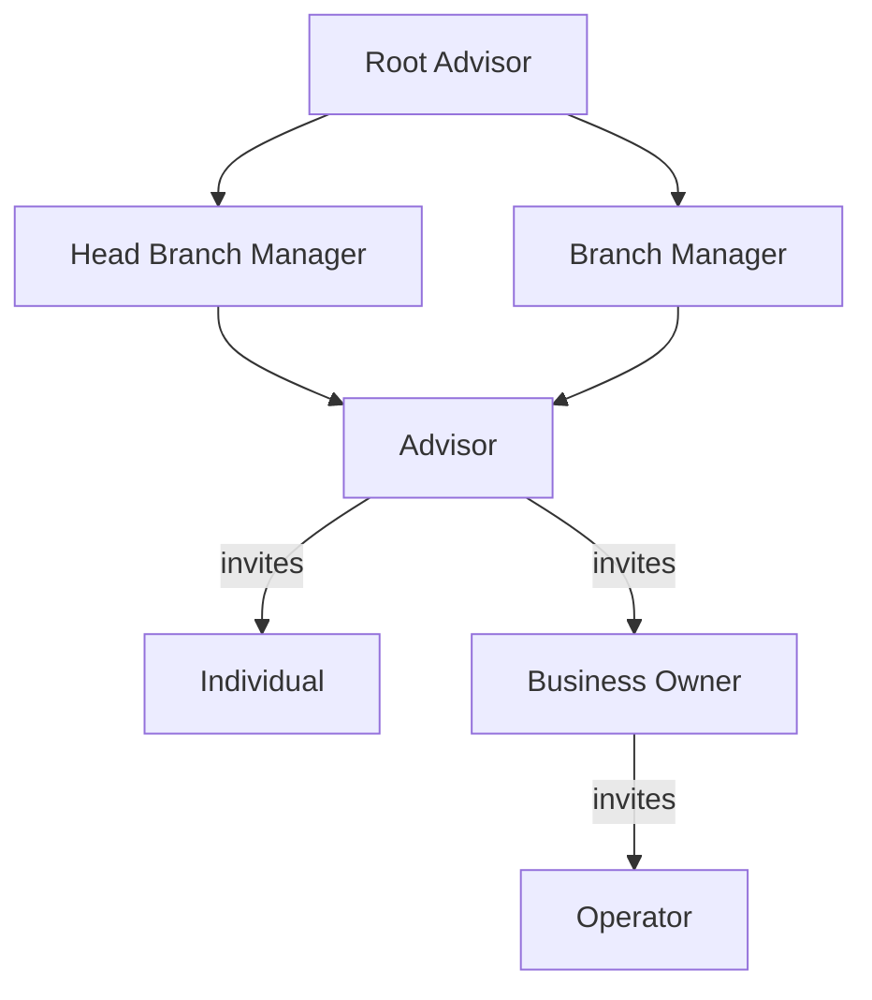
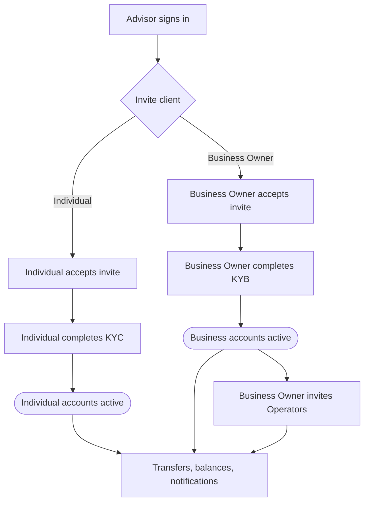

TappCash is a financial platform API that gives organizations programmatic control over the full banking lifecycle — from building out an admin hierarchy and onboarding clients through daily operations including transfers, account management, and reporting.

---

## Role Hierarchy

TappCash organizes users into two groups: **admin roles** that manage the organization and its clients, and **client-facing roles** that hold and operate financial accounts.



---

## Admin Roles

<Cards>
  <Card title="Root Advisor" href="./onboarding" icon="fa-duotone fa-crown">The highest admin tier. Manages the organization's entire structure — branches, Head Branch Managers, Branch Managers, and Advisors — and has full visibility across all client portfolios and reports.</Card>
  <Card title="Head Branch Manager" href="./onboarding" icon="fa-duotone fa-user-shield">Manages Advisors across branches and oversees all client activity — transfers, transfer requests, auto-payments, and reports. Has access to the chat module.</Card>
  <Card title="Branch Manager" href="./onboarding" icon="fa-duotone fa-user-gear">Manages Advisors within a branch. Reviews client portfolios, transfer requests, and reports. Configures approval settings for the branch.</Card>
  <Card title="Advisor" href="./onboarding" icon="fa-duotone fa-user-tie">The front-line admin role. Invites and manages Individual and Business Owner clients. Handles transfers, transfer requests, auto-payments, and client reports. Has access to the chat module.</Card>
</Cards>

---

## Client-Facing Roles

<Cards>
  <Card title="Individual" href="./individual-account" icon="fa-duotone fa-user">Holds personal financial accounts (checking and savings). Completes KYC verification, initiates internal transfers and ACH transactions, and views account activity and statements.</Card>
  <Card title="Business Owner" href="./onboarding" icon="fa-duotone fa-building">Holds business financial accounts. Completes KYB verification. Invites and manages Operators to act on their behalf.</Card>
  <Card title="Operator" href="./onboarding" icon="fa-duotone fa-user-lock">Manages a Business Owner's accounts with granted permissions. Can initiate transfers and set up auto-payments based on the access the Business Owner assigns.</Card>
</Cards>

---

## User Lifecycle



---

## Base URLs

| Environment | Base URL                                                    |
|-------------|-------------------------------------------------------------|
| Staging     | `https://api-test.stage2.tappbank.com`                      |
| Production  | Contact [support@tappcash.com](mailto:support@tappcash.com) |

All API paths are appended to the base URL. Example:

```
POST https://api-test.stage2.tappbank.com/users/public/v1/auth/signin
```

---

## API Versioning

Endpoints follow a versioned path pattern:

```
/{service}/{visibility}/v{version}/{resource}
```

| Segment      | Example                         | Meaning                                           |
|--------------|---------------------------------|---------------------------------------------------|
| `service`    | `users`, `branches`, `accounts` | Microservice owning the resource                  |
| `visibility` | `public`, `private`             | Public = no auth; Private = Bearer token required |
| `version`    | `v1`                            | API version                                       |
| `resource`   | `auth/signin`, `individual`     | Resource path                                     |

---

## Environments

**Staging** is for development and testing. Use test credentials and dummy data — no real money moves. Staging credentials will not work against the production base URL.

**Production** requires separate credentials issued by the TappCash platform team. Contact [support@tappcash.com](mailto:support@tappcash.com) to request production access.
