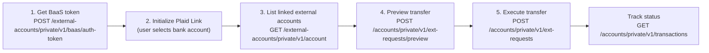

ACH transfers move funds between a TappCash account and an external bank account linked through Plaid. The flow applies to Individual users, Business Owners, and Operators (with `transferACH` permission).

---

## Flow



---

## Step 1 — Get a BaaS Token

`POST /external-accounts/private/v1/baas/auth-token`

- **Auth**: User access token (Individual, Business Owner, or Operator with `transferACH` permission)
- No request body

**Response:**

```json
{
  "data": {
    "token": "link-sandbox-abc123..."
  }
}
```

Pass this token to the Plaid Link SDK to open the bank account selection UI.

---

## Step 2 — Initialize Plaid Link

Use the BaaS token from Step 1 to initialize Plaid Link in your app. The user selects or connects their external bank account. Plaid handles credential entry and account selection.

Once the user completes Plaid Link, the linked account appears in the TappCash external accounts list.

---

## Step 3 — List Linked External Accounts

`GET /external-accounts/private/v1/account`

- **Auth**: User access token

```json
{
  "data": [
    {
      "id": "ext-acc-001",
      "accountNumber": "****1234",
      "routingNumber": "026009593",
      "accountOwnerName": "Jane Doe",
      "bankName": "Chase",
      "status": "active"
    }
  ]
}
```

Use `id` from the desired account as `fromAccountId` (pull) or `toAccountId` (push) in the preview step.

---

## Step 4 — Preview the Transfer

Always preview before executing — the response shows the exact fee and total amount to be deducted.

`POST /accounts/private/v1/ext-requests/preview`

- **Auth**: User access token

**Pull funds in (external → TappCash):**

```json
{
  "fromAccountId": "ext-acc-001",
  "toAccountId": "1001",
  "amount": "500.00"
}
```

**Push funds out (TappCash → external):**

```json
{
  "fromAccountId": "1001",
  "toAccountId": "ext-acc-001",
  "amount": "500.00"
}
```

**Response:**

```json
{
  "data": {
    "amount": "500.00",
    "fee": "2.50",
    "totalDeducted": "502.50"
  }
}
```

Show the fee breakdown to the user before they confirm.

---

## Step 5 — Execute the Transfer

`POST /accounts/private/v1/ext-requests`

- **Auth**: User access token

Same body as the preview, plus an optional `description`:

```json
{
  "fromAccountId": "ext-acc-001",
  "toAccountId": "1001",
  "amount": "500.00",
  "description": "Payroll funding"
}
```

**Response:**

```json
{
  "data": {
    "id": "txn-789",
    "status": "pending"
  }
}
```

ACH transfers are processed asynchronously — the initial status is `pending`.

---

## Track Transfer Status

Poll the transactions list or listen for push notifications to detect completion.

`GET /accounts/private/v1/transactions?filter[status]=pending`

| Status | Meaning |
|--------|---------|
| `pending` | Submitted, awaiting processing |
| `executed` | Transfer completed successfully |
| `rejected` | Transfer failed — check transaction details for reason |

Listen for the `TRANSACTION_EXECUTED` push notification to avoid polling.

---

## Notes

- **Transfer limits**: Call `GET /external-accounts/private/v1/transfer-limits` to retrieve the minimum and maximum ACH amounts before the preview step.
- **Branch approval**: If the branch has approval required (`is_bm_approval_required: true`), the transfer enters `pending_approval` status instead of `pending`. See the [Transfer Approval recipe](./transfer-approval).
- **Operators**: Must have the `transferACH` permission. Check via `GET /branches/private/v1/limited/operator/details` before rendering the ACH UI.
