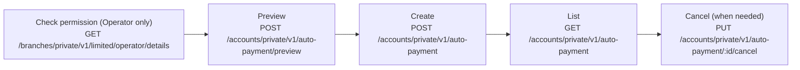

Auto-payments schedule recurring fund movements on a weekly, biweekly, or monthly cadence. They can be created by Individual users, Business Owners, or Operators (with `autoPay` permission).

---

## Flow



---

## Step 1 — Check Permission (Operators only)

Skip this step for Individual users and Business Owners — they can always manage auto-payments.

`GET /branches/private/v1/limited/operator/details`

- **Auth**: Operator access token

```json
{
  "data": {
    "permissions": {
      "transferFunds": true,
      "transferACH": false,
      "autoPay": true
    }
  }
}
```

If `autoPay` is `false`, do not render auto-payment UI. Any auto-payment call without this permission returns `403 Forbidden`.

---

## Step 2 — Preview

Always preview before creating — the preview confirms the per-period fee.

`POST /accounts/private/v1/auto-payment/preview`

- **Auth**: User or Operator access token

**Internal (TBA) auto-payment:**

```json
{
  "accountIdFrom": "42",
  "accountIdTo": "15",
  "amount": "250.00"
}
```

**ACH auto-payment (direct bank details, no Plaid required):**

```json
{
  "accountIdFrom": "42",
  "amount": "250.00",
  "accountToACH": {
    "accountNumber": "123456789012",
    "routingNumber": "026009593",
    "accountOwnerName": "Acme Vendor",
    "bankCountry": "US",
    "bankName": "JPMorgan Chase"
  }
}
```

**Response:**

```json
{
  "data": {
    "amount": "250.00",
    "fee": "1.25"
  }
}
```

Show the fee to the user before they confirm.

---

## Step 3 — Create

`POST /accounts/private/v1/auto-payment`

- **Auth**: User or Operator access token

Choose one of the three stop condition patterns:

### Option A — Stop on a fixed end date

```json
{
  "accountIdFrom": "42",
  "accountIdTo": "15",
  "amount": "250.00",
  "period": "monthly",
  "type": "end_date",
  "startDate": "02/01/2025",
  "endDate": "12/01/2025",
  "description": "Office rent"
}
```

### Option B — Run until manually cancelled

```json
{
  "accountIdFrom": "42",
  "accountIdTo": "15",
  "amount": "250.00",
  "period": "weekly",
  "type": "until_cancel",
  "startDate": "02/01/2025",
  "description": "Weekly payroll"
}
```

### Option C — Stop when cumulative total reaches a limit

```json
{
  "accountIdFrom": "42",
  "accountIdTo": "15",
  "amount": "250.00",
  "period": "biweekly",
  "type": "limit_amount",
  "startDate": "02/01/2025",
  "limitAmount": "5000.00",
  "description": "Vendor retainer cap"
}
```

| Field | Required | Notes |
|-------|:--------:|-------|
| `accountIdFrom` | ✓ | Source account ID |
| `accountIdTo` or `accountToACH` | ✓ | Destination — internal account or external bank |
| `amount` | ✓ | Per-period amount, must be > 0 |
| `period` | ✓ | `weekly`, `biweekly`, `monthly`, or `one_time` |
| `type` | ✓ | `end_date`, `until_cancel`, or `limit_amount` |
| `startDate` | ✓ | `MM/DD/YYYY` — must be at least the next calendar day |
| `endDate` | When `type=end_date` | Must be ≥ `startDate` |
| `limitAmount` | When `type=limit_amount` | Total cap in dollars |

---

## Step 4 — List Active Auto-Payments

`GET /accounts/private/v1/auto-payment`

- **Auth**: User or Operator access token

```
GET /accounts/private/v1/auto-payment?page[number]=1&page[size]=20
```

Returns all auto-payments for the account — both `active` and `completed`.

---

## Step 5 — Cancel

`PUT /accounts/private/v1/auto-payment/:autoPaymentId/cancel`

- **Auth**: User or Operator access token

No request body. Cancellation is immediate — no further payments will be processed after this call.

```
PUT /accounts/private/v1/auto-payment/88/cancel
Authorization: Bearer <token>
V-Client-Device-Id: <device-uuid>
```

---

## What's Next

- [Operator: Move Money](../operator/move-money) — one-off TBA and ACH transfers
- [Individual: Move Money](../individual-user/move-money) — one-off transfers for individual users
