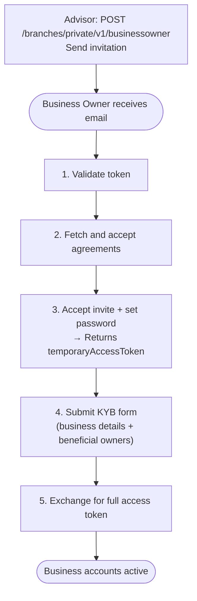

This recipe covers two phases: a Business Owner completing KYB to activate their business account, followed by the Business Owner inviting Operators with scoped permissions.

**Roles involved:** Advisor (admin), Business Owner client, Operator

---

## Phase 1 — Business Owner KYB Onboarding

### Flow



---

### Step 0 — Advisor: Send Invitation

`POST /branches/private/v1/businessowner`

- **Auth**: Advisor access token

```json
{
  "businessName": "Acme Corp",
  "firstName": "John",
  "lastName": "Smith",
  "phoneNumber": "+12025550102",
  "email": "john.smith@acmecorp.com",
  "advisorID": "<advisor-id>"
}
```

---

### Step 1 — Validate the Token

`GET /branches/public/v1/common/invites/check?token=<invite_token>`

- **Auth**: None

---

### Step 2 — Fetch Platform Agreements

`GET /branches/public/v1/common/agreements`

- **Auth**: None

Display all agreements. All must be acknowledged to continue.

---

### Step 3 — Accept Invitation and Set Password

`POST /branches/public/v1/business-owner/invites/accept`

```json
{
  "token": "<invite_token>",
  "password": "SecurePassword123!",
  "agreements": ["1", "2"]
}
```

**Response — HTTP 403 (intentional):**

```json
{
  "data": { "temporaryAccessToken": "eyJ..." }
}
```

Store the `temporaryAccessToken` — used for the KYB step.

---

### Step 4 — Submit KYB

`POST /branches/private/v1/business-owner/kyb`

- **Auth**: `temporaryAccessToken`

```json
{
  "businessName": "Acme Corp",
  "businessType": "LLC",
  "taxId": "12-3456789",
  "address": {
    "address": "123 Main St",
    "city": "Austin",
    "state": "TX",
    "zipCode": "78701",
    "country": "US"
  },
  "beneficialOwners": [
    {
      "firstName": "Jane",
      "lastName": "Doe",
      "dateOfBirth": "1985-06-15",
      "ownershipPercentage": 51
    }
  ]
}
```

Include all individuals who own 25% or more of the business as beneficial owners.

---

### Step 5 — Exchange for Full Access Token

`PUT /users/private/v1/limited/token-exchange`

- **Auth**: `temporaryAccessToken`

```json
{
  "data": {
    "accessToken": "eyJ...",
    "refreshToken": "LUF..."
  }
}
```

KYB review is asynchronous. The Business Owner can sign in and use limited features while pending. Full account access requires KYB approval.

---

## Phase 2 — Invite an Operator

Once the Business Owner is active, they can invite team members as Operators and assign permissions.

### Invite

`POST /branches/private/v1/operator`

- **Auth**: Business Owner access token

```json
{
  "firstName": "Sam",
  "lastName": "Lee",
  "email": "sam.lee@acmecorp.com",
  "phoneNumber": "+14155550123",
  "permissions": {
    "transferFunds": true,
    "autoPay": true
  }
}
```

| Permission | What it allows |
|------------|----------------|
| `transferFunds` | TBA internal transfers and ACH external transfers |
| `autoPay` | Create, update, and cancel recurring auto-payments |

An invitation email is sent to the Operator immediately.

### Operator Completes KYC

The Operator follows the same 10-step KYC flow as an Individual client — same endpoints, different invite acceptance URL:

`POST /branches/public/v1/operator/invites/accept`

All steps 4–10 use the same temporary token pattern. See the [Onboard an Individual](./onboard-individual) recipe for the full step-by-step.

### Update Permissions Later

`PUT /branches/private/v1/operator/{id}`

- **Auth**: Business Owner access token

```json
{
  "permissions": {
    "transferFunds": true,
    "autoPay": false
  }
}
```

---

## What's Next

- [Business Owner: Move Money](../business-owner/move-money) — TBA and ACH transfers
- [Operator guide](../operator) — full Operator-side reference
- [Auto-Payment recipe](./auto-payment) — set up recurring payments as an Operator
