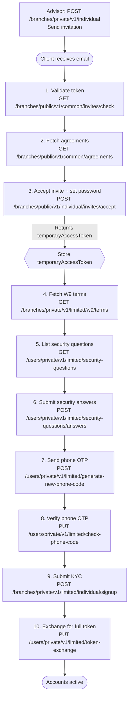

This recipe covers the complete path from an Advisor sending an invitation to an Individual client holding an active account with a full access token.

**Roles involved:** Advisor (admin), Individual client (end user)

---

## Flow



---

## Step 0 — Advisor: Send Invitation

`POST /branches/private/v1/individual`

- **Auth**: Advisor access token

```json
{
  "firstName": "Jane",
  "lastName": "Doe",
  "phoneNumber": "+12025550101",
  "email": "jane.doe@example.com"
}
```

An invitation email is sent immediately. The email contains a one-time `token` used in Step 1.

---

## Step 1 — Validate the Token

Before rendering any UI, check that the link is still valid.

`GET /branches/public/v1/common/invites/check?token=<invite_token>`

- **Auth**: None

If the response is not `200`, show "Invitation expired — please ask your Advisor to resend."

---

## Step 2 — Fetch Platform Agreements

`GET /branches/public/v1/common/agreements`

- **Auth**: None

Display each agreement to the user. All must be acknowledged before proceeding.

---

## Step 3 — Accept Invitation and Set Password

`POST /branches/public/v1/individual/invites/accept`

```json
{
  "token": "<invite_token>",
  "password": "SecurePassword#2024",
  "confirmPassword": "SecurePassword#2024",
  "agreementIds": [1, 2, 3]
}
```

**Response — HTTP 403 (intentional):**

```json
{
  "data": { "temporaryAccessToken": "eyJ..." },
  "errors": [{ "code": "required additional actions", "meta": { "fields": ["phoneNumber", "kyc"] } }]
}
```

> HTTP 403 here is intentional. Extract and store `data.temporaryAccessToken` — it gates all steps through Step 9.

---

## Step 4 — Show W9 Terms

`GET /branches/private/v1/limited/w9/terms`

- **Auth**: `temporaryAccessToken`

Display the W9 tax certification text. Record the timestamp of the user's acknowledgement — it is required in Step 9.

---

## Step 5 — List Security Questions

`GET /users/private/v1/limited/security-questions`

- **Auth**: `temporaryAccessToken`

Present the list and let the user choose 3 questions to answer.

---

## Step 6 — Submit Security Answers

`POST /users/private/v1/limited/security-questions/answers`

- **Auth**: `temporaryAccessToken`

```json
{
  "answers": [
    { "questionId": 1, "answer": "Seattle" },
    { "questionId": 5, "answer": "Buddy" },
    { "questionId": 9, "answer": "Blue" }
  ]
}
```

Exactly 3 distinct question IDs are required.

---

## Step 7 — Send Phone OTP

`POST /users/private/v1/limited/generate-new-phone-code`

- **Auth**: `temporaryAccessToken`

Triggers an SMS to the phone number registered during the invitation. No request body needed.

---

## Step 8 — Verify Phone OTP

`PUT /users/private/v1/limited/check-phone-code`

- **Auth**: `temporaryAccessToken`

```json
{ "code": "ABC12" }
```

---

## Step 9 — Submit KYC

`POST /branches/private/v1/limited/individual/signup`

- **Auth**: `temporaryAccessToken`

```json
{
  "dateOfBirth": "1990-03-20",
  "socialSecurityNumber": "987-65-4321",
  "usCitizenshipStatus": "Citizen",
  "address": {
    "address": "123 Main Street",
    "city": "New York",
    "state": "NY",
    "zipCode": "10001",
    "country": "US"
  },
  "w9": {
    "isSubjectToBackupWithholding": false,
    "accepted": true,
    "timestamp": "2024-03-15T14:22:00Z"
  },
  "employment": {
    "status": "employed",
    "employer": "Acme Corp",
    "occupation": "Engineer"
  },
  "transferActivity": {
    "expectedMonthlyTransactions": 10,
    "expectedMonthlyVolume": "5000.00"
  }
}
```

On `200`, KYC is submitted and processing asynchronously. On `400`, check `errors` for field-level failures and let the user correct and resubmit.

---

## Step 10 — Exchange for Full Access Token

`PUT /users/private/v1/limited/token-exchange`

- **Auth**: `temporaryAccessToken`

```json
{
  "data": {
    "accessToken": "eyJ...",
    "refreshToken": "LUF..."
  }
}
```

Store both tokens. Discard the `temporaryAccessToken` — it is no longer valid. The client's accounts are now live.

---

## What's Next

- [Move Money](../individual-user/move-money) — TBA and ACH transfers
- [Accounts](../individual-user/accounts) — list accounts and check balances
- [Token Refresh recipe](./token-refresh) — handle access token expiry
