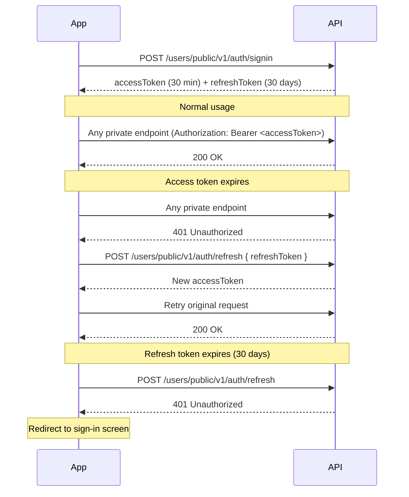

TappCash access tokens expire after **30 minutes**. This recipe shows how to implement silent token refresh so users stay logged in without interruption.

---

## Token Lifecycle



---

## Step 1 — Sign In

`POST /users/public/v1/auth/signin`

- **Auth**: None

```json
{
  "login": "user@example.com",
  "password": "YourPassword123!"
}
```

**Response:**

```json
{
  "data": {
    "accessToken": "eyJ...",
    "refreshToken": "LUF..."
  }
}
```

Store both tokens securely. Use `accessToken` on every private API call via the `Authorization` header.

---

## Step 2 — Use the Access Token

All private endpoints require:

```
Authorization: Bearer <accessToken>
V-Client-Device-Id: <device-uuid>
```

The `V-Client-Device-Id` is a stable UUID you generate per device/session and reuse across all calls.

---

## Step 3 — Detect Expiry and Refresh

When any private endpoint returns `401 Unauthorized`, refresh the access token automatically before showing an error to the user.

`POST /users/public/v1/auth/refresh`

- **Auth**: None

```json
{
  "refreshToken": "LUF..."
}
```

**Response:**

```json
{
  "data": {
    "accessToken": "eyJ..."
  }
}
```

Store the new `accessToken` and retry the original request. Do not prompt the user to re-login.

---

## Step 4 — Re-Authenticate When Refresh Token Expires

If `POST /auth/refresh` itself returns `401`, the refresh token has expired (after 30 days). Redirect the user to the sign-in screen.

---

## Token Reference

| Token | Lifetime | Used for |
|-------|----------|----------|
| `accessToken` | 30 minutes | All private API calls |
| `refreshToken` | 30 days | Obtaining a new `accessToken` |
| `temporaryAccessToken` | Single session | Individual/Operator onboarding steps only |

---

## Confirm Token Identity

Load the authenticated user's profile on app launch to confirm the token is valid and retrieve user context:

`GET /users/private/v1/auth/me`

- **Auth**: User access token

Returns the full user profile, role, and permissions.

---

## What's Next

- [Authentication guide](../authentication) — token types and scopes in detail
- [Error Handling](../error-handling) — full error code reference including `401` and `403`
