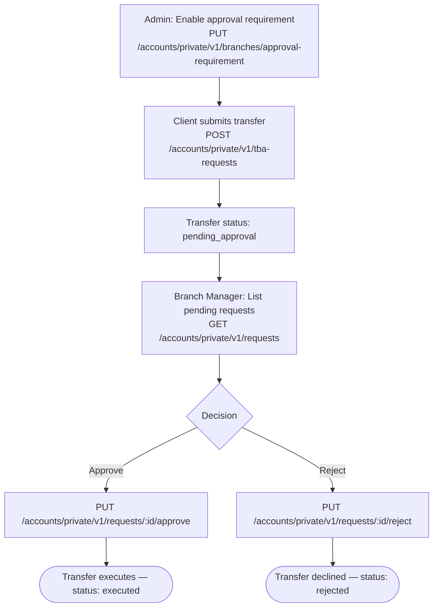

When a branch has approval required, every transfer request a client submits enters `pending_approval` status until a Branch Manager approves or rejects it. This recipe covers configuring the setting and handling the full approval lifecycle.

---

## Flow



---

## Step 1 — Enable Branch Approval Requirement

`PUT /accounts/private/v1/branches/approval-requirement`

- **Auth**: Branch Manager (or higher) access token

```json
{
  "isBmApprovalRequired": true
}
```

Once enabled, all new transfer requests from clients in this branch enter `pending_approval` instead of executing immediately.

---

## Step 2 — Client Submits a Transfer

The client initiates a standard TBA transfer:

`POST /accounts/private/v1/tba-requests`

- **Auth**: Individual or Business Owner access token

```json
{
  "accountIdFrom": 1001,
  "accountIdTo": 1002,
  "outgoingAmount": "500.00",
  "incomingAmount": "497.50",
  "description": "Savings top-up"
}
```

**Response — with approval required:**

```json
{
  "data": {
    "id": "req-456",
    "status": "pending_approval",
    "outgoingAmount": "500.00"
  }
}
```

The transfer does not move funds until a Branch Manager approves it.

---

## Step 3 — Branch Manager: List Pending Requests

`GET /accounts/private/v1/requests`

- **Auth**: Branch Manager access token

```
GET /accounts/private/v1/requests?filter[status]=pending_approval&page[number]=1&page[size]=20
Authorization: Bearer <bm_token>
```

**Response fields per request:**

| Field | Description |
|-------|-------------|
| `id` | Request identifier |
| `status` | `pending_approval`, `approved`, `rejected` |
| `outgoingAmount` | Amount being transferred |
| `description` | Client-provided note |
| `createdAt` | When the request was submitted |
| `user` | The client who initiated the request |

---

## Step 4a — Approve the Transfer

`PUT /accounts/private/v1/requests/:id/approve`

- **Auth**: Branch Manager access token

No request body. The transfer executes immediately after approval and the status changes to `executed`.

```
PUT /accounts/private/v1/requests/req-456/approve
Authorization: Bearer <bm_token>
```

---

## Step 4b — Reject the Transfer

`PUT /accounts/private/v1/requests/:id/reject`

- **Auth**: Branch Manager access token

```json
{
  "reason": "Insufficient supporting documentation"
}
```

The transfer is cancelled and the status changes to `rejected`. The client can view the rejection reason in their transaction history.

---

## Client-Side: Track Request Status

Clients can poll for their transfer request status:

`GET /accounts/private/v1/requests/:id`

| Status | Meaning |
|--------|---------|
| `pending_approval` | Awaiting Branch Manager review |
| `approved` | Approved — funds are being processed |
| `executed` | Transfer completed successfully |
| `rejected` | Declined by Branch Manager |

---

## Disable Approval Requirement

To turn off the approval requirement for a branch:

```json
{
  "isBmApprovalRequired": false
}
```

New transfers submit and execute immediately after this change. In-progress `pending_approval` requests are not affected.

---

## What's Next

- [Administration: Branches](../administration/branches) — branch setup and approval settings
- [Administration: Transfers](../administration/transfers) — admin visibility into transfer activity
